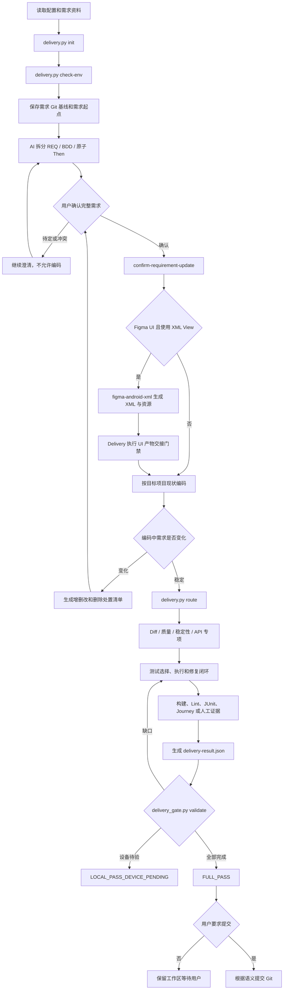

# Android Delivery Skills 整体流程说明

本文档面向流程使用者和后续维护模型，用于说明这套 Skill 为什么存在、每个角色负责什么、一次 Android 需求如何从理解走到交付，以及哪些情况必须阻断或降级。

本文档是整体理解入口，不取代具体执行规则。实际执行时仍以 `_shared/android-global-rules.md`、`android-implement-and-verify/SKILL.md` 和对应专项 `SKILL.md` 为准。

## 目录

1. [设计目标](#一设计目标)
2. [核心原则](#二核心原则)
3. [Skill 角色与职责](#三skill-角色与职责)
4. [脚本职责划分](#四脚本职责划分)
5. [端到端交付流程](#五端到端交付流程)
6. [需求确认与中途变更](#六需求确认与中途变更)
7. [编码与影响路由](#七编码与影响路由)
8. [自动化测试策略](#八自动化测试策略)
9. [Journey 的定位](#九journey-的定位)
10. [失败分析与自动修复](#十失败分析与自动修复)
11. [机器证据与防假绿](#十一机器证据与防假绿)
12. [最终结论与 Git](#十二最终结论与-git)
13. [用户需要提供什么](#十三用户需要提供什么)
14. [明确能力边界](#十四明确能力边界)
15. [规则来源与维护方式](#十五规则来源与维护方式)

## 一、设计目标

这套流程不是单纯让 AI 生成 Android 代码，而是让 AI 在受约束、可复核的前提下完成需求理解、编码、审查、测试、修复和交付。

目标包括：

- 需求没有理解清楚时不开始脑补式编码。
- 同一需求中途增删改时保留最近确认总需求和最初 Git 基线。
- 默认遵守最小化修改、单一职责、高内聚低耦合和业务隔离。
- Kotlin 优先，同时完整支持 Java、XML View、旧 Gradle 和旧测试框架。
- UI、非 UI 和混合业务都能分配到合适的测试层。
- 每个“通过”都有当前需求和最终代码上的新鲜证据。
- 专项工具失败时允许 AI 分析替代，仍无法关闭时明确提示用户。
- 没有设备或资料时诚实保留未验证项，不把能力缺失写成通过。
- Git 提交由用户决定，不把自动提交作为交付完成条件。

这套流程不能承诺任何代码绝对没有问题。它要实现的是：风险有门禁、结论有证据、职责有边界、失败有去向、未验证项不会被隐藏。

## 二、核心原则

### 2.1 需求优先

需求文档、用户补充、UI 资料和 API 资料共同构成需求输入。AI 只根据已经确认的信息生成 BDD 和实现，不发明接口字段、错误码、页面状态或测试结果。

### 2.2 最小修改

优先沿用目标项目现有架构、依赖、模块、命名、测试框架和 Gradle task。不得为了统一风格无关升级 AGP、Gradle、JDK，或把局部需求扩大成全项目重构。

### 2.3 单一职责

总入口只编排；Git 脚本只收集差异；需求脚本只维护修订；测试 Skill 只负责测试和修复；UI Skill 独立负责视觉与可访问性验收。一个脚本或 Skill 不吞并其他角色的职责。

### 2.4 自适应而非全量堆叠

根据已确认需求、最终 diff 和业务风险选择最低且足够的验证层。小改动不机械执行所有重型流程，高风险改动也不能因为代码行数少而跳过专项门禁。

### 2.5 证据优先

自然语言“已经通过”不是证据。最终结论必须引用真实命令、JUnit testcase、Android Lint 机器报告、专项结果、截图/布局或结构完整的人工执行记录。

### 2.6 用户控制

不自动切分支、stash、commit、push、reset、checkout 或 clean。清数据、卸载、真实支付、真实删除和生产环境操作也必须由用户明确授权。

## 三、Skill 角色与职责

| Skill | 角色 | 负责内容 | 不负责内容 |
|---|---|---|---|
| `android-implement-and-verify` | 项目负责人、总入口 | 读取需求、维护修订、建立 Git 基线、控制编码、路由专项、汇总最终交付 | 不代替专项完成详细审查 |
| `android-review-diff` | 变更范围 Reviewer | 检查需求覆盖、改动越界、误改旧逻辑、遗漏调用方和回归风险 | 不负责整体架构和测试执行 |
| `android-review-code-quality` | 架构与质量 Reviewer | 检查职责边界、耦合、重复、可维护性和项目架构一致性 | 不负责需求确认和动态稳定性 |
| `android-audit-stability` | 稳定性工程师 | 检查生命周期、资源释放、泄漏、并发、性能、安全隐私及动态能力适用性 | 不把静态未发现问题写成绝对无泄漏 |
| `android-test-and-fix` | 测试工程师与修复门禁 | 分析测试场景、选择测试层、执行测试、分析失败、最小修复和回归 | 不负责设计稿视觉还原 |
| `android-verify-api-contract` | API 契约检查员 | 检查 endpoint、Request/Response、DTO、mapper、错误码、缓存字段和兼容性 | 不负责普通架构和 UI 验收 |
| `android-verify-ui` | 独立 UI 验收工程师 | 检查设计还原、截图、布局、动态 UI 和可访问性 | 不生成或管理业务测试用例，不由 route 自动执行 |
| `figma-android-xml` | 外部 XML UI 生产 Skill | 在已确认的 Figma + XML View 场景生成 XML、Drawable、Color、Dimen 和预览资源 | 不写 Kotlin/Java 业务逻辑，不负责行为测试和最终 UI 验收 |

`android-verify-ui` 保持独立。Journey 可以证明用户操作和可见结果，UI 验收负责判断页面是否符合设计基准；二者可以复用截图，但不能互相代替。

`figma-android-xml` 作为成熟黑盒单向接入：Delivery 只判断是否满足“Figma + XML View”，传入已确认设计，接收 UI 资源和 XML；不复制它的内部生成规则，也不修改它的脚本或配置。产物进入项目后执行独立交接门禁，确保用户文案、图片语义、项目资源和业务代码边界服从 Delivery 全局规则。Compose 需求继续服从目标项目现有实现。

## 四、脚本职责划分

| 脚本 | 单一职责 |
|---|---|
| `scripts/delivery.py` | 读取需求、检查环境、确认修订和编排 route |
| `scripts/config_paths.py` | 统一解析项目、需求和项目外状态路径 |
| `scripts/git_changes.py` | 只读收集分支、基线、committed/staged/unstaged/untracked、A/M/D/R 和实际 patch |
| `scripts/requirement_snapshot.py` | 保存确认需求、原子 Then、修订清单和文本差异 |
| `scripts/requirement_inputs.py` | 为需求正文及配置声明的 UI/API 资料生成稳定摘要 |
| `scripts/route_impact.py` | 保存最终 diff 触发的最小条件门禁快照 |
| `scripts/android_project_capabilities.py` | 只读发现模块、variant 和现有 Gradle task |
| `scripts/execution_evidence.py` | 执行一条已选择命令并生成单 gate、不可覆盖的机器收据 |
| `scripts/specialist_result.py` | 校验专项结果、P0-P3、capability 和证据摘要 |
| `scripts/delivery_gate.py` | 校验最终报告与当前需求、代码和全部证据是否一致 |
| `android-test-and-fix/scripts/run_journey.py` | 执行已经判定适用的可选壳 Journey，并生成结构化结果 |

所有基线、route 快照、执行日志和专项结果默认保存在目标 Android 项目之外，避免证据文件本身改变项目 diff。

## 五、端到端交付流程

### 5.1 初始化

`delivery.py init` 读取当前需求。中途重复执行时，它只对比最近确认修订并显示变化，不删除当前需求 Git 基线。

### 5.2 环境与基线

`delivery.py check-env` 校验项目路径、目标分支和干净工作区，在项目外保存当前需求的 Git 起点与需求起点。脏工作区不能直接开启一个新的串行需求。

### 5.3 需求确认

AI 根据需求生成稳定的 `REQ-###`、`BDD-###` 和 `BDD-001/T1` 原子 Then。只有全部待定和冲突项解决后，`confirm-requirement-update` 才推进确认修订并允许编码。

### 5.4 编码与路由

编码遵守目标项目现状。Figma + XML View 场景先由 `figma-android-xml` 生成纯 UI 资源和 XML，总入口对本轮产物执行 I18n、A11y、资源复用和业务代码边界交接门禁，再接管 Kotlin/Java、ViewBinding/DataBinding、状态和业务连线；Compose 或非 Figma 场景不调用该 XML Skill。完成后执行 `route`，脚本候选与 Diff Reviewer 对七类影响的语义确认取并集，再选择专项和测试。

### 5.5 最终门禁

所有必需命令和专项完成后，生成一次性 `delivery-result.json`。`delivery_gate.py validate` 校验证据并从可信结果生成面向用户的中文 `delivery-summary.md`，不运行测试、不修代码；退出码为 0 才允许使用通过结论。最终回复优先展示中文摘要，JSON 只作机器附件。

## 六、需求确认与中途变更

### 6.1 确认修订

第一次确认形成 R1，后续变化从最近确认版本比较并形成 R2、R3。每次修订都保存当前有效原子 Then，旧证据绑定原 Then 摘要，语义变化后自动失效。

### 6.2 中途增加或修改需求

编码中用户补充需求时，重新执行 `init`，把聊天补充同步到需求资料或修订清单，输出更新后的总需求。未确认内容不能进入实现和最终证据。

### 6.3 删除需求

删除已确认内容时必须明确一种处置：

- 删除对应实现；
- 保留兼容实现；
- 停止尚未完成的实现。

没有处置结论时不推进修订，避免需求从文档消失但旧代码无意保留。

### 6.4 串行需求

当前需求未完成时，不把另一个独立需求混入同一 Git 基线。完成当前需求后，再为下一需求建立新的干净基线。项目外证据按需求 ID、修订、完整输入摘要和代码摘要隔离，不复用上一需求结果。

### 6.5 完整输入摘要

最终上下文同时绑定：

- 规范化需求正文；
- `ui` 配置、链接和本地 UI 资料；
- `api` 配置、链接和本地接口文件；
- 当前确认修订；
- Git 基线和最终代码摘要。

设备、重试次数和 Journey 执行环境属于运行条件，不进入需求摘要，避免制造虚假的需求修订。

## 七、编码与影响路由

### 7.1 风险分层

- `L1`：局部、低风险、单影响面，没有高风险边界。
- `L2`：存在可观察业务变化，或两个以上影响面协作。
- `L3`：支付、金额、鉴权、隐私、迁移、并发、生命周期、权限、后台、硬件、公共 API、R8、反射或核心跨模块链路。
- `BLOCKED`：缺少继续实现必需的业务预期、设计基准或接口契约。

风险按业务后果和调用链判断，不按改动行数判断。

### 7.2 最终 diff 路由

| 变化信号 | 主要路由 |
|---|---|
| Compose、XML、资源、导航和可见页面 | UI 候选、测试路由，UI 验收保持独立 |
| Retrofit、Service、DTO、Request/Response、mapper、网络 Repository | API 契约专项 |
| Room、DataStore、Proto、序列化格式、数据库版本 | 迁移门禁与迁移测试 |
| Manifest、权限、Service、Receiver、后台能力 | 系统和安全隐私候选 |
| Gradle、依赖、variant、R8、反射 | 构建、兼容和稳定性候选 |
| DI、模块边界、公共接口、跨模块调用 | 代码质量和 Diff Review |
| 生命周期、资源、线程、Coroutine、Flow | 稳定性、并发和泄漏审查 |

API 资料缺失且继续实现会脑补 endpoint 或字段时，API 专项可以前置阻断；通常仍在编码后根据真实实现做最终契约审查。

脚本只负责快速发现候选，不维护所有框架关键词。`android-review-diff` 必须基于当前需求和真实 diff 逐项确认 UI、API、数据、系统、构建、架构和测试影响；即使普通文件名中的 Ktor、SharedPreferences 或权限调用未被正则识别，语义确认仍会进入最终机器门禁。

## 八、自动化测试策略

每个原子 Then 选择最低且足够可靠的测试层，不要求所有需求执行所有测试类型。

| 需求类型 | 首选验证 |
|---|---|
| Kotlin/Java 纯业务规则、计算、状态转换 | Unit Test |
| ViewModel、Coroutine、Flow、状态机 | Unit Test / Coroutine Test |
| Repository、缓存、数据库协作 | Integration Test / Robolectric |
| Retrofit、DTO、请求字段、错误码 | MockWebServer / Contract Test |
| Room schema 和旧数据升级 | Migration Test |
| Android 生命周期和组件行为 | Robolectric / Instrumentation |
| 稳定、顺序明确的可见 UI 旅程 | Journey / Espresso / Compose UI |
| 设计稿、像素、布局和可访问性 | `android-verify-ui` |
| 设备、硬件、真实权限、动态泄漏 | 模拟器、真机或明确待验证 |
| 无法安全自动化的外部闭环 | 结构完整的人工收据 |

### 8.1 无 UI 需求

Repository、数据库、缓存、算法、后台任务、接口映射和并发逻辑不调用 Journey。使用 Unit、Integration、Contract、Migration、Robolectric 或已有项目测试。

### 8.2 混合需求

把混合需求按原子 Then 拆开。例如“点击保存后写入数据库并显示成功”：

- 点击和可见成功状态由 UI 测试或 Journey 验证；
- 字段映射由 Unit Test 验证；
- 请求参数由 Contract Test 验证；
- 数据库存储由 Integration 或 Migration Test 验证；
- 页面是否符合设计稿由独立 UI 验收验证。

任一测试层只能覆盖自己实际断言的 Then，不能因为一条 Journey 通过就覆盖整条业务。

### 8.3 老项目兼容

识别并沿用项目已有 JUnit4/JUnit5、Robolectric、Mockito、PowerMock、Espresso、Instrumentation runner、自定义 variant 和 Gradle task。不为统一风格迁移测试框架，不升级目标 AGP、Gradle 或 JDK。

## 九、Journey 的定位

Journey 是用户行为旅程工具，不是万能 UI 测试，也不负责视觉还原。

### 9.1 适合场景

- 启动应用、点击、输入、返回和稳定页面跳转；
- 验证明确可见的文本、控件和短业务链路；
- 登录、搜索、创建、编辑等可控主流程；
- 少量关键黑盒回归。

### 9.2 不适合场景

- 精确像素比较和设计稿还原；
- 多指、复杂拖拽、折叠屏和不稳定手势；
- 摄像头、蓝牙、NFC 等硬件闭环；
- 不可控系统弹窗、真实支付、验证码和第三方登录；
- 数据库内部状态、接口字段、后台任务和复杂并发；
- 不稳定的真实后端或生产敏感数据。

### 9.3 两次判断、一次执行

需求确认后，根据 BDD 初判 Journey 为 `FULL/PARTIAL/NONE`；编码完成后再根据真实 diff、入口、前置条件和设备能力终判。只有终判仍分配了验证义务时才执行。

### 9.4 默认 Agent 与可选壳

默认由当前 AI 会话使用 Android CLI/adb 按 XML action 逐步操作和判断。`journey-harness` 是已经通过 Android Studio 官方模板初始化后的可选回退壳，用于老项目无法直接采用新插件的情况；它不升级或修改目标项目。

壳未初始化、没有设备或 Journey 不适用时，不阻断其他本地测试。改用项目已有 UI 测试、其他测试层或完整人工证据，并保留能力损失。

Journey 用例归 `android-test-and-fix`，默认保存在当前需求作用域下。`android-verify-ui` 只复用截图或布局做独立验收，不管理 Journey 用例。

## 十、失败分析与自动修复

失败后先分类，再决定修改对象：

| 分类 | 含义 | 处理方向 |
|---|---|---|
| `REQUIREMENT_BLOCKED` | 缺少业务预期、接口契约或设计基准 | 请求最小必要输入，不继续脑补 |
| `ENVIRONMENT_FAILED` | SDK、Gradle、设备、网络或测试环境失败 | 修环境或使用等价路径，不改生产逻辑 |
| `TEST_FAILED` | 用例、fixture、数据、Given 或断言有误 | 只修测试侧并重新验证 |
| `IMPLEMENTATION_FAILED` | 生产代码与已确认需求不符 | 做最小生产修复并回归 |
| `UNKNOWN` | 当前证据无法定位根因 | 继续采证，仍无法定位则请求输入或阻断 |

修复闭环：

1. 保留首个失败命令、退出码、日志和报告。
2. 一次只处理一个当前主根因。
3. 优先使用对应专项能力和项目已有工具。
4. 专项能力不足时，由 AI 根据代码和真实日志进行替代分析。
5. 只有证据指向生产代码时才修改生产代码。
6. 每轮修复后重跑失败项和受影响回归集。
7. 同一根因连续三轮仍无法关闭时停止碰运气，说明需要的资料、权限、设备或人工动作。

禁止通过删除测试、注释断言、扩大容差、添加无依据 sleep、排除 Gradle task、修改 baseline 或把失败改成人工项来造绿。

## 十一、机器证据与防假绿

### 11.1 单 gate 执行收据

每条最终命令通过 `execution_evidence.py` 执行，并记录：

- 唯一 evidence ID 和唯一 gate；
- 不可覆盖的 `attempt-001/002/...`；
- 参数数组、执行目录和起止时间；
- 命令退出码、脱敏 stdout/stderr；
- JUnit testcase 或 Android Lint XML/SARIF；
- 日志、报告和产物 SHA-256；
- 当前需求、完整输入、Git 基线和最终代码摘要。

### 11.2 gate 证明边界

- `android-build`：真实 Gradle `assemble*` 或 `bundle*` 收据。
- `android-lint`：真实 Gradle `lint*` 收据和本轮 XML/SARIF；Fatal/Error 即使零退出也阻断。
- `android-test-and-fix`、`android-data-migration`：实际执行数大于零且无失败的本轮 JUnit，或允许的 Agent/人工路径。
- API、UI/A11y、安全、泄漏和性能：对应专项 capability；允许人工的动态项必须使用完整人工收据。
- Diff、代码质量和稳定性核心 gate：对应专项 Skill 的统一结果。

普通成功命令不能通过填写同名 `gate_id` 冒充专项证据。

### 11.3 原子 Then 证据

普通自动覆盖必须把 `BDD/Then` 映射到 JUnit 中真实存在且状态为 PASS 的 testcase。非零测试总数不能代替具体映射。Agent Journey 必须记录实际 action/check、执行数量和布局/截图产物。

### 11.4 人工收据

人工验证必须记录执行人、带时区时间、设备/环境、逐步操作、预期、实际、状态及产物摘要；确实没有产物时说明原因。计划以后执行不能写成 `COVERED_MANUAL`。

### 11.5 已阻断的假绿

- 命令没有实际执行或只有手填 `exit_code=0`；
- 测试/迁移没有 JUnit、零测试、失败或全部 skipped；
- Then 没有真实通过 testcase；
- Lint 报告仍有 Fatal/Error；
- 一份收据跨 gate 复用或任意命令冒充专项；
- 同一 ID 重跑覆盖第一次失败；
- 报告、日志或产物被修改；
- 测试后代码、需求修订或 UI/API 输入又发生变化；
- 空人工说明、空设备待验项或无关证据占位。

## 十二、最终结论与 Git

`delivery-result.json` 是当前需求和最终代码的一次性交付结果，不是通用 phase/state 状态机。

| 结论 | 含义 |
|---|---|
| `FULL_PASS` | 所有必需 Then 和 gate 都有当前、有效、可复核证据，没有待验证能力 |
| `LOCAL_PASS_DEVICE_PENDING` | 本地门禁全部完成，但存在真实设备待验项，并引用同能力未验证证据 |
| `INCOMPLETE` | 仍有未完成项，报告如实保留缺口 |
| `BLOCKED` | 缺少关键需求、环境、权限、设备或存在无法关闭的根因 |

核心通过 gate 包括 Diff Review、代码质量、稳定性、测试与修复、构建和 Android Lint。API、迁移、UI/A11y 和安全隐私由最终 route 候选决定是否成为条件 gate。

没有真机不自动否定已经完成的本地范围，也不能把动态能力写成已通过。`LOCAL_PASS_DEVICE_PENDING` 不是 `FULL_PASS` 的空别名。

流程验证通过后不会自动提交 Git。只有用户明确要求提交时，才检查本地 diff、生成语义化提交信息并提交；push 和 PR 仍需要单独授权。

## 十三、用户需要提供什么

通常只需要：

- 目标项目路径，可以来自全局或本机配置；
- 当前需求文档；
- 可选 UI 设计链接、截图、资源；
- 可选 API 文档链接或本地契约文件；
- 需求本身缺少关键业务含义时的澄清；
- 真机、账号、权限或人工动作确实不可替代时的协助。

用户通常不需要手写 Journey XML、action/step、Gradle task、测试用例或最终 JSON。AI 应从已确认需求和真实项目能力中分析生成；无法可靠确定时才请求最小必要输入。

## 十四、明确能力边界

### 14.1 远程资料

需求输入摘要自动哈希本地 UI/API 文件和配置中的远程 URL，但不访问网络。Figma MCP 负责结构化设计数据，`figma_workflow.py fetch` 只提供 PNG 视觉基准；本轮采用的截图应保存到 `<requirement_dir>/ui/` 或登记到 `ui.screenshots` / `ui.directory`。这样同一 Figma URL 内容变化后，新截图 SHA-256 会使旧 route 和交付证据失效；只有 URL 而没有本地基准时，必须记录该证据缺口。

### 14.2 设备能力

没有设备时无法完成真实 UI/A11y、动态泄漏、部分性能、权限和硬件闭环。流程会继续全部本地与模拟器可验证项，并把剩余范围标成设备待验，而不是伪造通过。

### 14.3 未知工具与老项目

不默认安装 Maestro、Appium、LeakCanary、自定义 Lint 或其他重型工具。优先使用项目已有能力和 Android 自带 Gradle Lint；工具不存在时使用等价验证或保留未验证原因。

### 14.4 绝对零风险

任何流程都不能诚实承诺所有 Android 需求绝对没有 Bug。当前目标是显著降低遗漏、回归、泄漏和耦合风险，并确保每个剩余风险都能被看见、复核和追踪。

## 十五、规则来源与维护方式

### 15.1 唯一规则来源

1. `_shared/android-global-rules.md`：所有 Android Skill 共用的最小修改、单一职责、安全和证据规则。
2. `android-implement-and-verify/SKILL.md`：完整需求交付的唯一流程来源。
3. 各专项 `SKILL.md`：专项触发条件、职责边界、检查方法和报告格式。
4. `SIMPLE_USAGE.md`：面向使用者的名称和命令速查。
5. `references/open-source-design-rationale.md`：开源参考、采用/拒绝原因和长期不变量。
6. `android-implement-and-verify/references/delivery-eval-scenarios.md`：修改 Skill、路由或门禁后的行为评测集。
7. `android-implement-and-verify/references/conditional-capability-gates.md`：条件能力和无真机降级边界。
8. `android-test-and-fix/references/adaptive-test-routing.md`：风险分层、测试路由和 Journey 适用性。
9. `android-implement-and-verify/references/*.schema.json`：需求修订、route、执行收据、专项和最终结果机器契约。

规则冲突时按以下顺序处理：目标项目更严格的 `AGENTS.md` / `CONTRIBUTING.md` → `_shared/android-global-rules.md` → 当前 Skill。无法确定时暂停说明，不自行选择宽松规则。

### 15.2 维护约束

- 维护、扩展或质疑流程前，先读取 `references/open-source-design-rationale.md`，确认现有设计依据、采用/拒绝原因和长期不变量，避免后续 AI 重复推翻已经确认的取舍。
- 新的跨 Skill 约束只写入 `_shared/android-global-rules.md`。
- 新的完整交付步骤只写入 `android-implement-and-verify/SKILL.md`。
- 专项细节只写入对应 Skill，低频细节放入 `references/` 或 `assets/`。
- 本文档只维护整体理解和导航，不代替机器契约或专项规则。
- 新增或修改 Python 文件时，主动补齐中文文件简介、类/函数/测试方法用途和必要的核心逻辑注释；简单赋值和显而易见分支不添加废注释，注释必须与实现同步更新。
- 修改脚本行为时同步修改同职责文档和测试。
- 修改 Skill、路由或门禁后运行行为评测、单元测试、Schema 校验和 Skill 结构校验。
- 只有真实需求暴露可复现问题时再做最小修复，不进行没有证据的无限扩展。

一句话概括：这是一套“AI 可以执行，但不能自说自话”的 Android 需求交付体系。它允许 AI 根据具体项目智能选择路径，但在需求、改动范围、测试证据、风险结论和 Git 操作上设置不可越过的边界。
