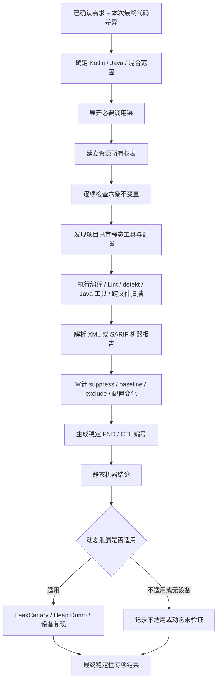

# Android Kotlin / Java 静态稳定性分析

> 个人资料，更新时间：2026-07-20。本文不被任何日常 Skill 引用，不参与需求路由、代码审查或测试上下文。

## 一句话介绍

我设计了一套面向 Android Kotlin、Java 和混合老项目的增量静态稳定性流程。它不靠无限增长的泄漏关键词，而是从本次需求差异出发，沿必要调用链建立对象与资源所有权，使用六条生命周期和并发不变量判断风险；再复用项目已有 Android Lint、detekt、Error Prone、SpotBugs、Semgrep 或 CodeQL，把 SARIF、执行命令、实际扫描范围和稳定问题编号写入机器门禁。静态结论与 LeakCanary、内存快照或设备复现的动态结论严格分开。

## 目录

1. [我解决的核心问题](#我解决的核心问题)
2. [总体架构](#总体架构)
3. [六条静态不变量](#六条静态不变量)
4. [一次审查如何执行](#一次审查如何执行)
5. [Kotlin、Java 和混合项目处理](#kotlinjava-和混合项目处理)
6. [机器证据与防假绿](#机器证据与防假绿)
7. [两阶段增强内容](#两阶段增强内容)
8. [开源项目参考](#开源项目参考)
9. [为什么不直接安装所有工具](#为什么不直接安装所有工具)
10. [静态与动态的能力边界](#静态与动态的能力边界)
11. [老项目和历史债务](#老项目和历史债务)
12. [典型案例](#典型案例)
13. [常见面试问题](#常见面试问题)
14. [三种时长的表达模板](#三种时长的表达模板)
15. [术语解释](#术语解释)
16. [实现文件索引](#实现文件索引)

## 我解决的核心问题

Android 内存泄漏和稳定性问题很难用一份固定清单覆盖，原因包括：

- 泄漏本质是对象存活时间和引用关系错误，不是某个 API 名字出现就一定有问题。
- Kotlin Lambda、匿名对象、协程、Flow 和 Compose Effect 可能产生隐式持有。
- Java 非静态内部类、Handler、Executor、RxJava 和旧式 Callback 有自己的生命周期契约。
- 真实项目还有生成代码、反射、闭源 SDK、混淆和多模块边界。
- 一个静态工具只覆盖部分语言和规则，零告警不能证明绝对安全。
- 老项目可能有大量历史告警，不能为了一个需求顺手重构整个仓库。

因此我的目标不是承诺“代码绝对没有问题”，而是保证：

1. 本次修改涉及的所有权和清理关系都被明确审查。
2. 每个通过结论都有绑定最终代码的新鲜证据。
3. 静态未发现、动态未验证和明确问题不会混写。
4. 新增问题不能被 baseline、排除或抑制静默隐藏。
5. 换一个 AI 或需求修订后，同一个问题仍能持续追踪。

## 总体架构



职责保持分离：

| 组件 | 职责 |
|---|---|
| 稳定性 Skill | 判断所有权、生命周期、并发、严重级别和动态适用性 |
| 测试 Skill | 发现并执行项目已有工具，不决定业务风险 |
| 能力发现脚本 | 读取任务、构建配置和 CI 信号，不运行检查 |
| 静态分析脚本 | 解析 SARIF、生成稳定编号、审计门禁控制面 |
| 执行证据脚本 | 执行一条已选择命令，保存不可覆盖收据 |
| 专项结果校验器 | 强制静态能力、七项检查、证据和阻断结论完整 |

## 六条静态不变量

### 1. 短生命周期对象不能被长生命周期对象持有

Activity、Fragment、View、ViewBinding、Dialog 或捕获它们的 Lambda，不应进入单例、静态字段、Application、长驻线程或无界缓存。

核心问题：谁持有谁，持有时间是否超过被持有对象的正确生命周期。

### 2. 注册与解绑必须成对

Listener、Callback、Observer、Receiver、传感器监听和第三方 SDK 注册必须有对应解绑，并且通常要使用同一个实例或令牌。

核心问题：重复进入、异常退出和部分初始化时，解绑是否仍然覆盖真实注册。

### 3. 获取与释放必须成对

Cursor、Stream、Socket、Camera、WebView、MediaPlayer、ExoPlayer 等资源必须在正常、异常、取消和提前返回路径上释放。

核心问题：释放的是不是实际持有的实例，初始化中途失败是否也能清理。

### 4. 异步任务不能超过宿主生命周期

协程、Flow 收集、Handler、Runnable、Thread、Future、Timer 和网络回调必须有明确所有者和取消入口。

核心问题：页面销毁后任务是否还会更新旧 View、导航或继续产生副作用。

### 5. 清理路径必须真实可达

代码里存在 `cleanup()`、`onDispose` 或 `awaitClose` 不代表清理一定正确。需要验证正常、异常、取消、重复进入和部分初始化路径。

核心问题：清理时机、条件、实例和顺序是否与创建阶段真正配对。

### 6. 共享可变状态必须有并发纪律

多线程、多个调度器或异步回调访问同一状态时，需要单一所有者、线程约束、不可变快照或明确同步策略。

核心问题：旧请求晚返回、复合操作、集合并发修改、锁顺序和主线程等待。

## 一次审查如何执行

### 第一步：确定边界

从已确认需求和最终代码差异出发，只审查本次新增、修改或直接受影响的路径，不无目的扫描整个老项目。

### 第二步：展开必要调用链

```text
创建 / 注册 / 启动
→ 持有 / 订阅 / 调度
→ 正常使用
→ 页面结束 / 异常 / 取消 / 重复进入
→ 释放 / 解绑 / 关闭
```

向上追到能够确定所有者的最近入口，向下追到能够确定副作用和清理契约的最近实现。

### 第三步：建立资源所有权表

| 对象或资源 | 创建位置 | 持有者 | 正确生命周期 | 释放位置 | 引用逃逸 | 证据或风险 |
|---|---|---|---|---|---|---|
| 页面监听器 | `onStart` | 第三方 SDK | 到 `onStop` | 未找到 | SDK 长期持有 | 明确风险 |
| ExoPlayer | Activity | Activity | 到 `onDestroy` | `release()` | 无 | 静态路径完整 |

未知内容写“未确认”，不能根据经验补齐。

### 第四步：运行项目已有能力

优先顺序：

1. Kotlin/Java 编译和 Android Lint。
2. Kotlin 项目已有 detekt。
3. Java 项目已有 Error Prone、NullAway、SpotBugs、Infer 或 PMD。
4. 项目已有 Semgrep、CodeQL 或 CI 静态扫描。
5. 动态适用时使用项目已有 LeakCanary、内存快照或设备复现。

工具不存在时记录能力损失，不自动安装、不升级 Gradle，也不把“没运行”写成通过。

### 第五步：审计控制面变化

以下变化不会自动判成生产缺陷，但必须逐项解释：

- `@Suppress`、`@SuppressWarnings`、`noinspection`、`nosemgrep`；
- detekt、Lint、SpotBugs 等 baseline；
- `exclude`、`disable`、`ignoreFailures`、`abortOnError=false`；
- 静态工具 Gradle 配置和 CI 工作流变化。

每项生成稳定 `CTL-...` 编号，处置为：

- `JUSTIFIED`：理由、范围和替代证据完整；
- `REMOVED`：不合理变化已从最终代码删除；
- `BLOCKING`：尚未解释或用于隐藏问题，不能通过。

### 第六步：输出有边界结论

允许的静态结论只有三种：

- 明确静态问题；
- 在指定范围内未发现明确静态问题；
- 静态证据不足。

动态结论单独写通过、失败或未验证。

## Kotlin、Java 和混合项目处理

### Kotlin

- 检查 Scope/Job 所有者和取消传播。
- 检查 `callbackFlow` 的注册、`awaitClose` 和同实例解绑。
- 检查 `stateIn/shareIn` 的共享作用域与数据所有者。
- 检查 Compose `LaunchedEffect` key、`DisposableEffect` 和 `onDispose`。
- 检查 Lambda、匿名对象、`object` 和缓存中的隐式 Activity/View 捕获。

### Java 与老项目

- 检查匿名内部类、非静态内部类和 Handler 对 Activity 的隐式引用。
- 检查 Executor、Future、Timer 和自研线程池的取消/关闭。
- 检查 RxJava Disposable、Scheduler、重复订阅和终止事件。
- 检查 `observeForever`、Receiver、Listener、Callback 的原实例解绑。
- 检查 try-with-resources 或 finally 是否覆盖全部资源出口。

### Kotlin 与 Java 混合

- Java 无空值注解返回值在 Kotlin 中形成平台类型。
- Java 可以向 Kotlin 非空参数传 null，需要在真实边界校验。
- 检查 primitive/boxed、集合可变性、泛型和 SAM/Callback 转换。
- 检查 Future/RxJava 与 coroutine/Flow 桥接时异常和取消能否双向传播。
- 公共接口变化区分源码兼容、二进制兼容和行为兼容。

原则是 Java 一等支持，但不复制第二套流程，也不强制老项目迁移 Kotlin、协程或 Compose。

## 机器证据与防假绿

### 稳定性专项 version 4

稳定性结果必须包含必需能力 `android-static-semantics`，并逐项记录七个检查：

1. 短生命周期持有；
2. 注册与解绑；
3. 获取与释放；
4. 异步生命周期；
5. 清理可达性；
6. 并发纪律；
7. 静态门禁控制面变化。

同时记录：

- Kotlin、Java、混合或无代码范围；
- 实际审查文件；
- 工具版本、模式、扫描范围和是否跨文件；
- 控制面处置；
- 稳定问题编号。

缺少任何一项，机器校验直接拒绝稳定性通过。

### 通用 SARIF 收据 version 3

SARIF 是静态分析结果的通用机器格式。流程不会只相信命令退出码，而会重新读取报告：

- 统计 Error、Warning、Note；
- 提取工具、规则、文件和行号；
- 生成稳定 `FND-...`；
- 报告文件和代码摘要变化后使旧证据失效；
- SARIF 中 `new/updated/unknown` Error 即使命令返回 0 也不能通过；明确 `unchanged` 的历史 Error 保留记录但不扩大本次修改。

### 稳定问题编号

问题身份由以下稳定语义计算：

```text
工具或不变量
+ 规则编号
+ 项目相对路径
+ 类/方法/资源符号
+ 工具指纹或稳定问题摘要
```

行号只用于定位，不参与身份，所以增加注释或移动代码不会把同一个问题重新编号。

## 两阶段增强内容

### 第一阶段：机器执行闭环

- 把静态语义变成稳定性专项的必需机器能力。
- 把六条不变量和控制面审查变成七项固定检查。
- 增加通用 SARIF 解析和独立静态分析收据。
- 能力发现从 Gradle 任务扩展到构建配置、静态配置和 CI 信号。
- 对新增抑制、baseline、exclude 和失败策略强制给出处置理由。
- 控制面审计绑定当前 Git 基线和代码摘要，机器校验候选不得漏写或伪造。

### 第二阶段：跨模型一致性

- 未关闭问题统一使用稳定 `FND-...` 编号。
- Kotlin、Java、混合代码分别提供安全、危险和证据不足样例。
- 评测同时检查误报：不能看到 Singleton、资源或 `onDispose` 关键词就机械下结论。
- 需求修订只移动代码行时，同一问题不得丢失或重复计数。

## 开源项目参考

下表是 2026-07-20 的近似 GitHub Star 快照。Star 只反映社区影响力，不代表某个工具能单独证明 Android 无泄漏。

| 项目 | 约 Star | 采用的思想 | 明确拒绝的做法 |
|---|---:|---|---|
| [JetBrains/kotlin](https://github.com/JetBrains/kotlin) | 53k | 编译器类型和语言语义 | 用编译通过冒充生命周期安全 |
| [ReactiveX/RxJava](https://github.com/ReactiveX/RxJava) | 48k | Disposable、Scheduler、终止契约 | 强制老项目迁移协程 |
| [alibaba/p3c](https://github.com/alibaba/p3c) | 31k | Java 规则工程化 | 用编码规范冒充泄漏证明 |
| [square/leakcanary](https://github.com/square/leakcanary) | 30k | 被保留对象和 Leak Trace | 所有项目自动增加依赖 |
| [MobSF](https://github.com/MobSF/Mobile-Security-Framework-MobSF) | 21k | 静态/动态证据分层 | 把一次扫描写成完整安全通过 |
| [gradle/gradle](https://github.com/gradle/gradle) | 19k | 可重复任务和构建事实 | 猜测任务名、升级 wrapper |
| [semgrep/semgrep](https://github.com/semgrep/semgrep) | 16k | Kotlin/Java 语义规则与 SARIF | 下载未知规则并冒充跨模块证明 |
| [facebook/infer](https://github.com/facebook/infer) | 16k | Java 资源、空值和并发分析 | 把 Java 优势冒充完整 Kotlin 覆盖 |
| [Kotlin/kotlinx.coroutines](https://github.com/Kotlin/kotlinx.coroutines) | 14k | 结构化并发和取消传播 | 只检查 API 名，不检查所有者 |
| [OWASP MASTG](https://github.com/OWASP/owasp-mastg) | 13k | 证据与测试边界 | 把静态检查称为渗透测试 |
| [github/codeql](https://github.com/github/codeql) | 9.8k | Java/Kotlin 跨文件数据流 | 未配置项目自动建库和下载查询 |
| [checkstyle/checkstyle](https://github.com/checkstyle/checkstyle) | 9k | 规则与持续门禁 | 用格式通过证明稳定性 |
| [google/error-prone](https://github.com/google/error-prone) | 7.2k | Java 编译期错误 | 为了接入而改造老项目编译链 |
| [detekt/detekt](https://github.com/detekt/detekt) | 7k | Kotlin 规则、类型解析、SARIF | 更新 baseline 或批量 suppress 造绿 |
| [androidx/androidx](https://github.com/androidx/androidx) | 6k | Lifecycle、Compose 和 Lint 契约 | 把最新 API 当老项目唯一方案 |
| [pmd/pmd](https://github.com/pmd/pmd) | 5.5k | Java AST 规则 | 把风格规则当生命周期证明 |
| [uber/NullAway](https://github.com/uber/NullAway) | 4.1k | Java 空值约束 | 把零 NPE 告警写成无泄漏 |
| [spotbugs/spotbugs](https://github.com/spotbugs/spotbugs) | 3.9k | Java 字节码缺陷模式 | 忽略源码和 Android 生命周期契约 |
| [SonarSource/sonar-java](https://github.com/SonarSource/sonar-java) | 1.2k | Java 符号分析和规则生命周期 | 每个项目强制部署完整平台 |
| [slackhq/slack-lints](https://github.com/slackhq/slack-lints) | 247 | Android/Kotlin Lint 规则测试方式 | 直接复制整套公司规则 |

Android Lint 是 Android 项目的默认基线，但其官方源码不适合用单一 GitHub Star 排名衡量，因此单独作为必跑能力，不混入排名。

## 为什么不直接安装所有工具

成熟工程不是工具越多越好。直接堆叠会带来：

- 老 Gradle、AGP、JDK 兼容失败；
- 规则重叠和大量误报；
- baseline 越来越大，真实新增问题被噪声掩盖；
- 本地与 CI 结果不一致；
- 小需求验证时间失控；
- 为了通过工具而无关重构业务代码。

因此采用“已有工具优先 + 能力损失显式记录 + AI 必要调用链复核 + 动态按需验证”。新工具只有在用户明确允许、收益和兼容性可证明时才接入。

## 静态与动态的能力边界

静态分析可以证明：

- 单例或静态字段明确持有 Activity/View；
- Listener 注册后没有任何解绑路径；
- Flow/协程/Handler 的所有者和取消路径缺失；
- 资源获取后某些出口明确不释放；
- Java/Kotlin 边界存在可证明的空值或取消问题。

静态分析不能完整证明：

- 闭源 SDK 内部是否长期持有对象；
- 运行时依赖注入和反射后的真实对象图；
- 页面反复进入退出后的堆保留情况；
- 厂商系统、硬件和长期运行行为。

这些情况需要 LeakCanary、Leak Trace、Heap Dump、模拟器或真机。没有动态证据时写“动态泄漏未验证”，但不否定已经完成的静态审查。

## 老项目和历史债务

老项目告警分成四类：

| 类型 | 含义 | 处理 |
|---|---|---|
| 本次新增 | 当前需求产生 | 高严重级别必须关闭 |
| 直接受影响 | 原问题位于本次调用链，可能被放大 | 结合证据处理或阻断 |
| 历史遗留 | 需求开始前存在且不在影响范围 | 记录，不扩大本次修改 |
| 来源不明 | 没有可比较基线 | 明确能力损失，不脑补 |

流程不会为了清理 500 个旧告警扩大当前需求，也不会因为旧告警多就忽略本次新增的两个问题。只有工具在可比较报告中明确标记 `unchanged` 才按历史问题处理；缺少标记仍是来源不明，不能由 AI 自行降级。

## 典型案例

### Kotlin 单例捕获 Activity

```kotlin
object Registry {
    var callback: (() -> Unit)? = null
}

Registry.callback = { activity.render() }
```

引用链是：进程级单例 → Lambda → Activity。没有清理路径时属于明确静态问题。优先修正所有权，而不是直接使用弱引用。

### callbackFlow 未清理监听

```kotlin
callbackFlow {
    val listener = Listener { trySend(it) }
    client.register(listener)
}
```

需要核对客户端注销契约。确认没有框架托管清理后，违反注册/解绑、异步生命周期和清理可达三项原则。

### Java Handler 延迟任务

```java
handler.postDelayed(() -> render(), 60_000L);
```

Lambda 可能持有 Activity，消息队列持有 Lambda。修复必须同时处理引用所有权和 `removeCallbacks`，不能只把内部类改成静态。

### 安全反例

```java
try (BufferedReader reader = Files.newBufferedReader(path)) {
    return reader.readLine();
}
```

正常和异常出口都由 try-with-resources 关闭资源，不能看到 Reader 和 return 就误报泄漏。

## 常见面试问题

### 1. 为什么不用一份常见内存泄漏清单？

清单只能覆盖已知写法，框架和 API 会持续变化。所有权和生命周期不变量能够覆盖新框架，同时要求结论落到真实调用链，误报更少。

### 2. AI 静态审查可靠吗？

不能只信自然语言，因此我把审查拆成固定机器检查、实际文件范围、工具证据、稳定编号和最终代码摘要。AI 负责工具难以表达的所有权语义，机器负责防止漏执行和伪造通过。

### 3. 为什么静态工具零告警仍不能说无泄漏？

工具只覆盖启用的规则、语言和扫描范围。生命周期问题还可能跨文件、经过闭源 SDK 或运行时对象图，需要动态证据。

### 4. 为什么使用 SARIF？

它允许多种工具输出统一的规则、级别、位置和指纹。我可以复用一个证据收集器，同时保留原始工具和报告，不为每个工具重写整套协议。

### 5. 如何防止 `abortOnError=false` 或 baseline 造绿？

收据直接解析报告，不只看退出码；同时审计 suppress、baseline、exclude 和失败策略变化，没有处置理由就阻断。

### 6. 如何处理误报？

工具告警只是候选。需要沿创建、持有、使用、退出和清理链复核 API 契约。合理抑制可以保留，但必须最小范围、给出理由和替代证据。

### 7. 如何兼容 Java 老项目？

共用六条所有权原则，沿用 Handler、Executor、Future、RxJava 和 try-with-resources 的真实契约；只运行项目已有工具，不强制迁移语言或构建体系。

### 8. 如何处理 500 个历史告警？

根据需求 Git 起点和报告基线区分新增、受影响、历史和来源不明。本次只关闭新增及直接受影响的高风险问题，不扩大范围。

### 9. 为什么问题编号不使用行号？

行号会随注释和格式变化。稳定编号使用规则、相对路径、符号和语义指纹，需求修订后仍能识别同一个问题。

### 10. 没有真机怎么办？

继续完成静态、编译、Lint、单元测试和模拟器可覆盖项；动态泄漏保持未验证。只有需求明确要求动态无泄漏证明时，才阻断完整通过，不阻断其他工作。

### 11. 为什么不默认接入 CodeQL 或 LeakCanary？

CodeQL 建库和查询较重，LeakCanary 会改变项目依赖。老项目兼容性和最小修改优先，先复用已有能力，新增依赖需要用户授权和收益证明。

### 12. 这套方案的不足是什么？

它仍不能证明所有运行时对象图和第三方内部行为，也依赖 AI 正确理解调用链。为降低风险，我增加了跨模型评测、安全反例、机器必填检查、工具覆盖记录和动态证据边界。

## 三种时长的表达模板

### 30 秒

我做的是一套 Android 增量静态稳定性流程。它从需求差异出发，用六条所有权和生命周期原则审查 Kotlin、Java、协程、Flow、Compose、Handler 和 RxJava，再复用项目已有 Lint、detekt、SpotBugs、Semgrep 或 CodeQL。工具结果统一成 SARIF 证据，新增抑制和 baseline 必须解释，问题使用稳定编号。静态结果和 LeakCanary 或设备动态结果分开，兼容老项目且不强制安装工具。

### 1 分钟

我没有维护无限的内存泄漏关键词，而是抽象成六条不变量：短生命周期不能被长生命周期持有、注册解绑成对、获取释放成对、异步任务不超过宿主、清理路径可达、共享状态有并发纪律。审查从本次 diff 展开必要调用链，并建立资源所有权表。项目已有工具通过独立执行器运行，SARIF 报告会被重新解析，不能靠零退出码造绿；新增 suppress、baseline 和 exclude 也会进入控制面审查。稳定性机器结果必须逐项记录七项检查、工具范围和稳定问题编号。没有设备时静态工作继续，动态泄漏明确未验证。

### 3 分钟

先介绍问题：Android 泄漏跨 Kotlin、Java、框架和运行时，单一工具无法覆盖。再介绍抽象：六条不变量和资源所有权表。然后说明执行：需求基线与最终 diff → 必要调用链 → 项目已有工具发现 → 编译/Lint/语言工具 → SARIF 收据 → suppress/baseline 审计 → 稳定编号 → 动态条件验证。最后说明工程取舍：不强制安装 20 个工具、不升级老项目、不清理无关历史债务，不宣称零风险；通过机器契约和新鲜证据让不同 AI 都难以漏掉关键步骤。

## 术语解释

| 术语 | 中文含义 |
|---|---|
| 静态分析 | 不运行完整应用，通过源码、类型、字节码或数据流发现问题 |
| 生命周期 | 对象、任务或资源应该存活的时间范围 |
| 所有权 | 谁创建、持有、使用并负责释放对象 |
| 必要调用链 | 只展开能够证明创建、持有、逃逸和清理关系的路径 |
| SARIF | 多种静态工具共用的机器报告格式 |
| FND 编号 | 未关闭问题的稳定身份，代码移动后仍可追踪 |
| CTL 编号 | 抑制、基线、排除和配置变化的稳定审查身份 |
| baseline | 静态工具记录的已有告警集合，不应加入本次新增问题 |
| suppress | 对某条告警的局部忽略，需要明确理由和范围 |
| 类型解析 | 工具理解真实类型、调用和依赖，而不只读取语法文本 |
| 跨文件分析 | 工具能够沿多个文件或模块追踪调用和数据流 |
| 动态泄漏 | 应用实际运行后，对象仍被不合理保留的证据 |

## 实现文件索引

| 文件 | 用途 |
|---|---|
| `android-audit-stability/SKILL.md` | 稳定性执行规则和机器结论要求 |
| `android-audit-stability/references/kotlin-java-static-analysis.md` | 六条不变量和调用链方法 |
| `android-audit-stability/references/static-analysis-eval-scenarios.md` | Kotlin、Java、混合及安全反例评测 |
| `scripts/static_analysis.py` | SARIF、FND/CTL 编号和控制面审计 |
| `scripts/android_project_capabilities.py` | Gradle、配置和 CI 能力发现 |
| `scripts/execution_evidence.py` | 独立静态分析执行收据 |
| `scripts/specialist_result.py` | 稳定性 version 4 机器门禁 |
| `android-implement-and-verify/references/specialist-result.schema.json` | 专项结果数据契约 |
| `android-implement-and-verify/references/execution-receipt.schema.json` | 执行收据数据契约 |
| `references/open-source-design-rationale.md` | 开源参考和长期设计理由 |

最终表述应保持诚实：这套方案显著降低生命周期、资源释放、并发和静态门禁遗漏风险，并保证风险可追踪、证据可复核；它不会承诺任何 Android 代码绝对没有问题。
