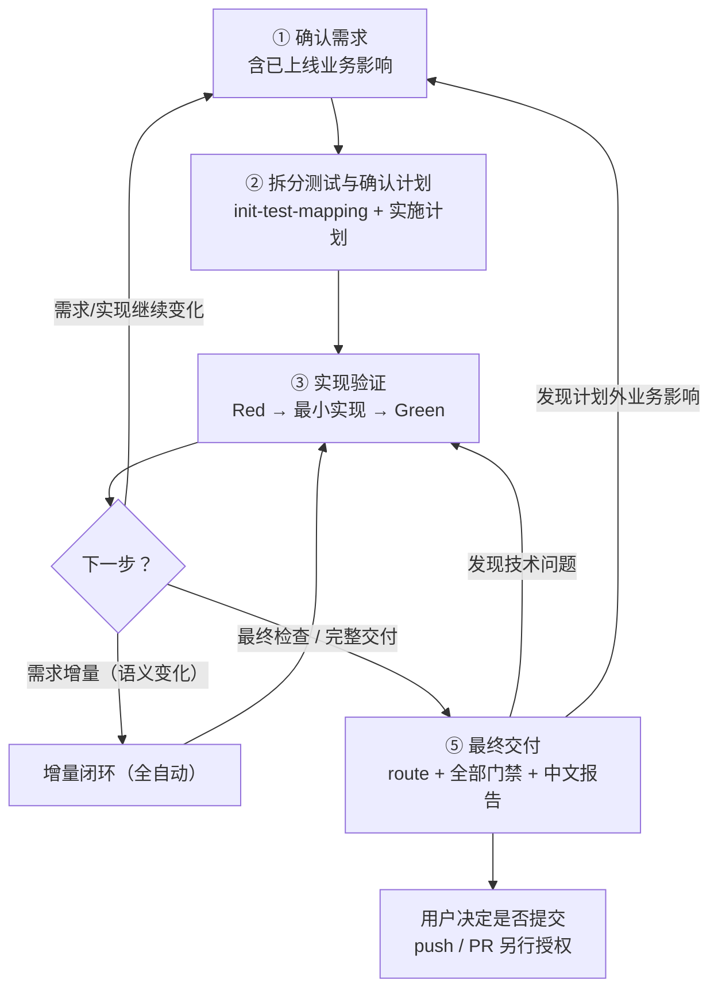
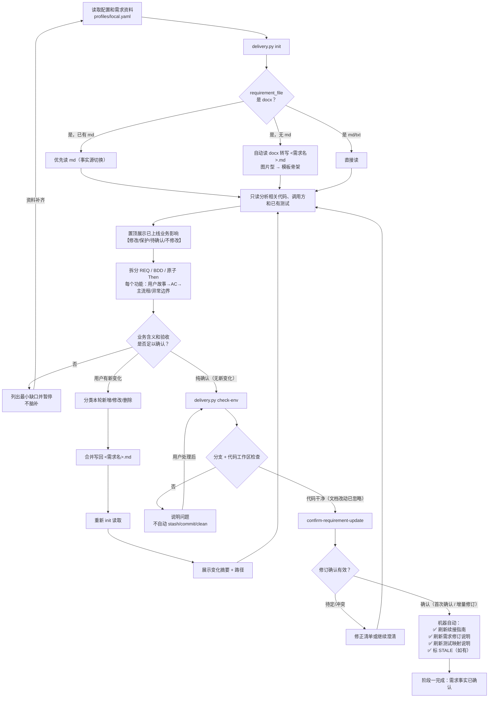
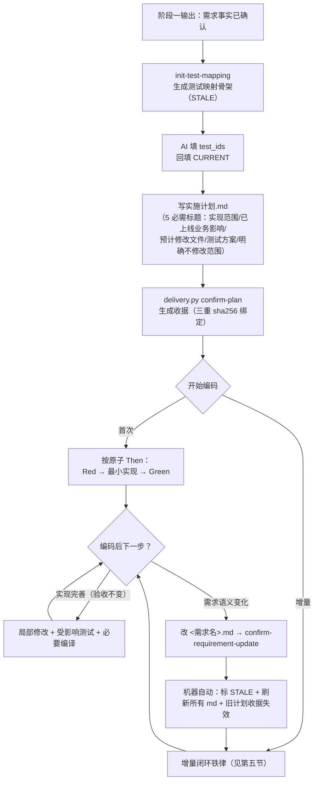
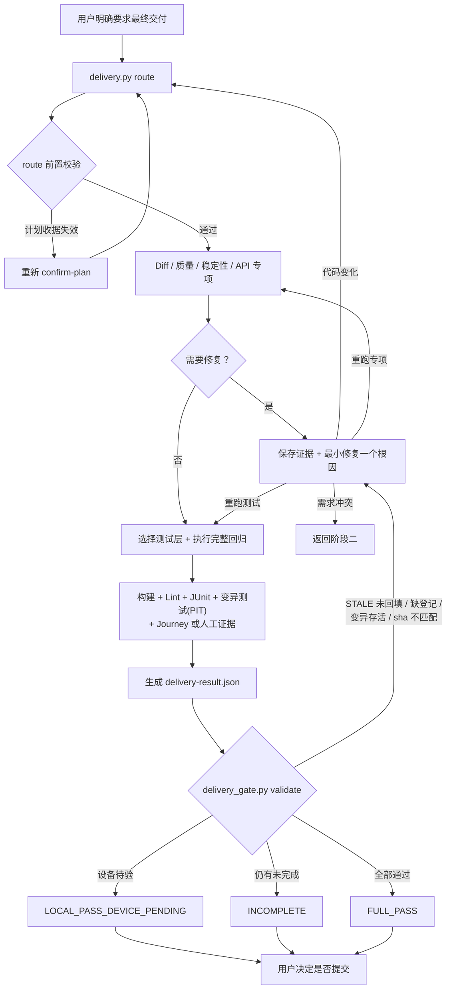
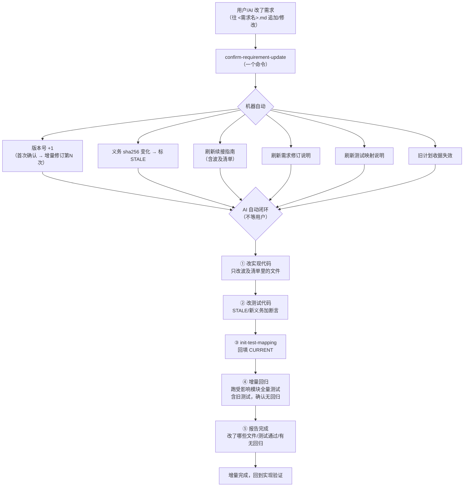
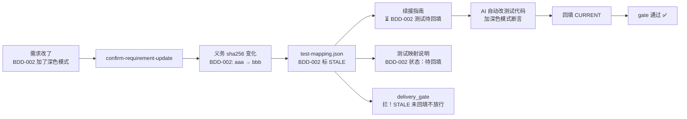
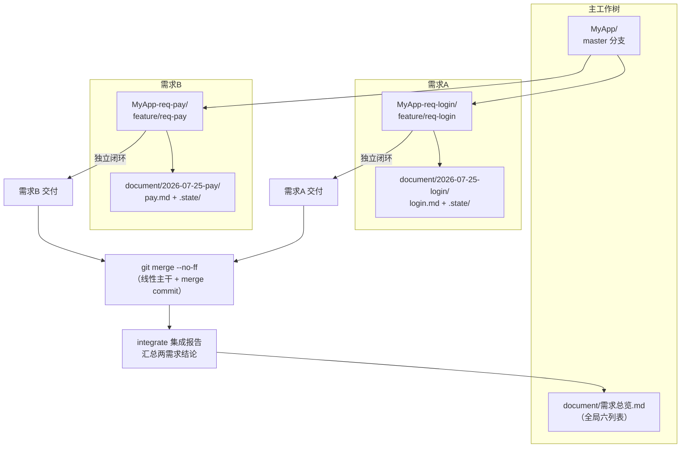
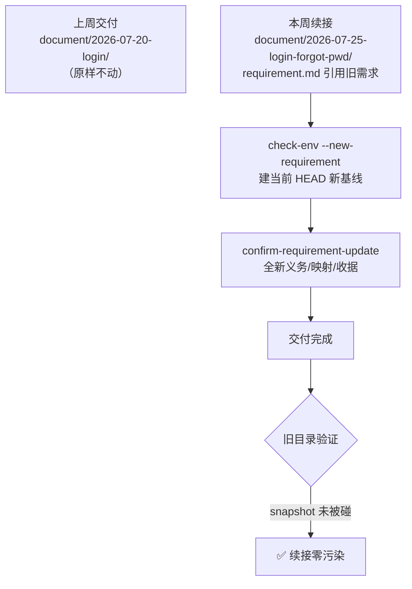
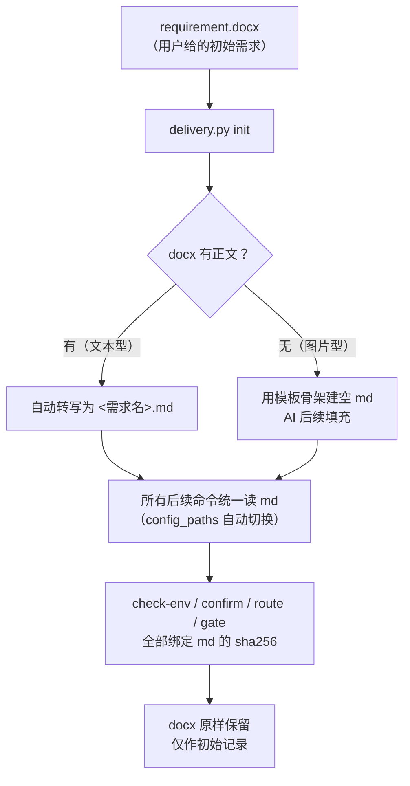

# Android Delivery Skills 完整流程图

> 配合 FLOW_OVERVIEW.md 使用，本文件只放流程图（mermaid），帮助可视化。

## 一、五步总览

## 二、阶段一：确认需求与基线

## 三、阶段二：拆分测试、确认计划与实现

## 四、阶段三：最终审查与交付

## 五、增量闭环（需求增量后全自动）

## 六、STALE 联动机制（防改需求不更新测试）

## 七、多需求并行（git worktree）

## 八、续接旧需求（新目录 + 引用）

## 九、docx → md 事实源切换

