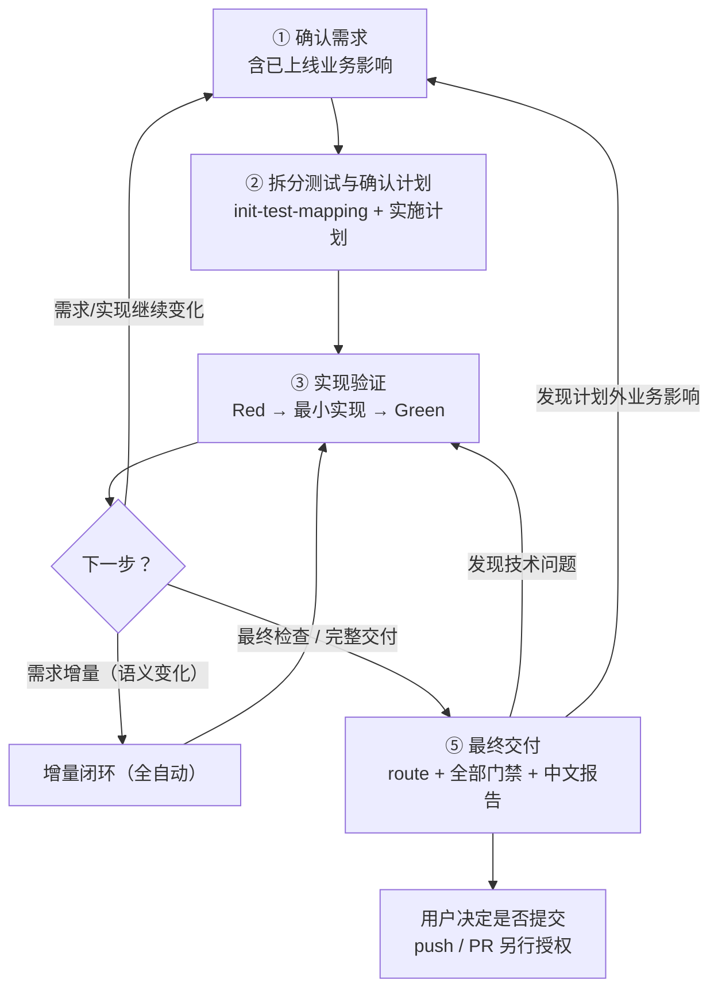
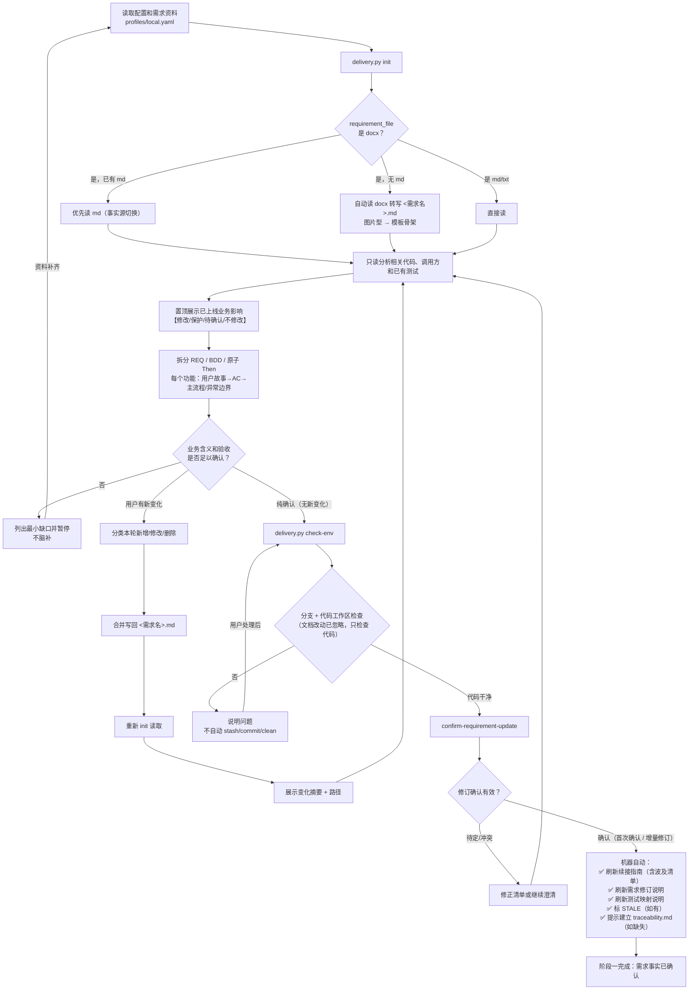
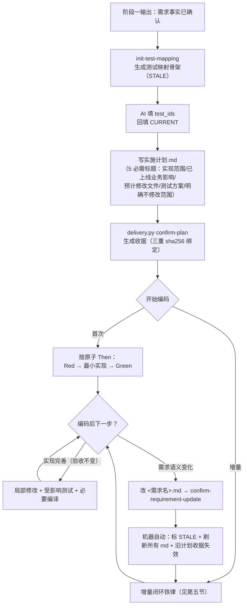
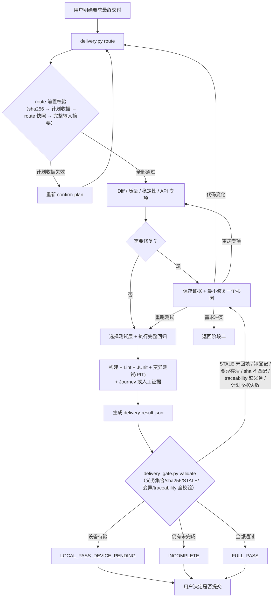
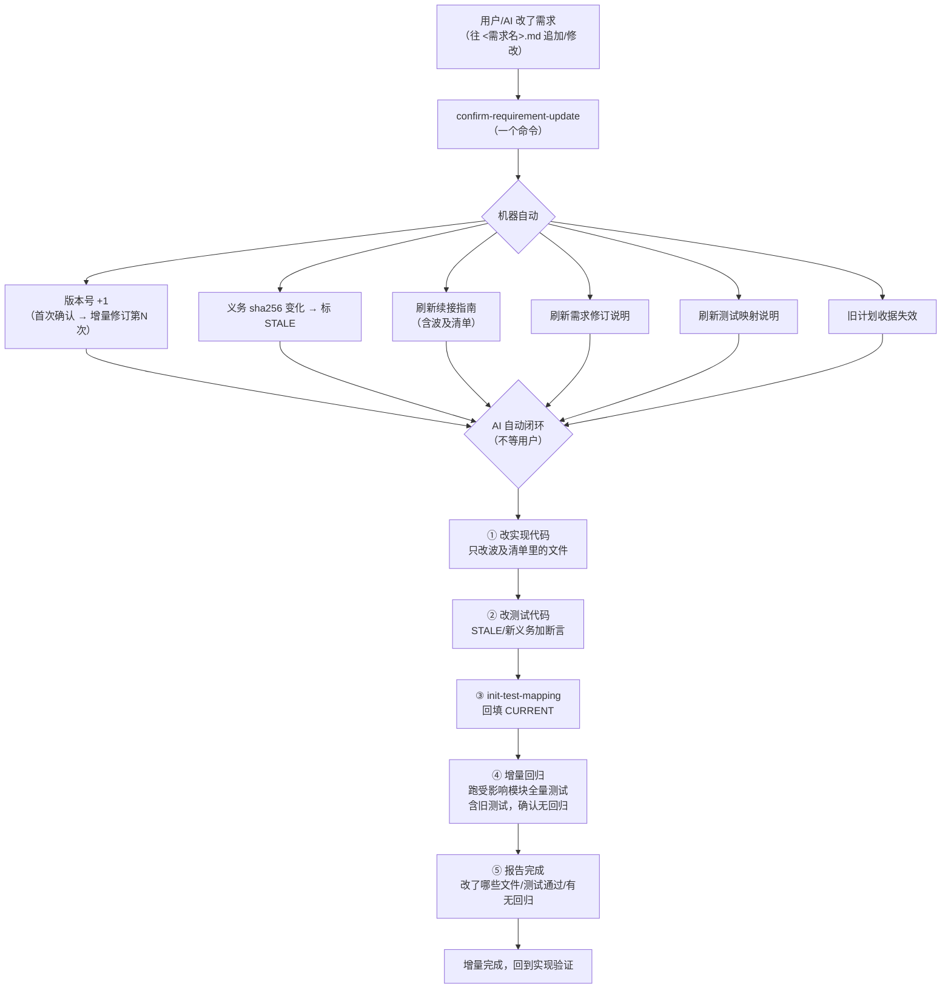
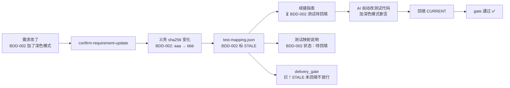
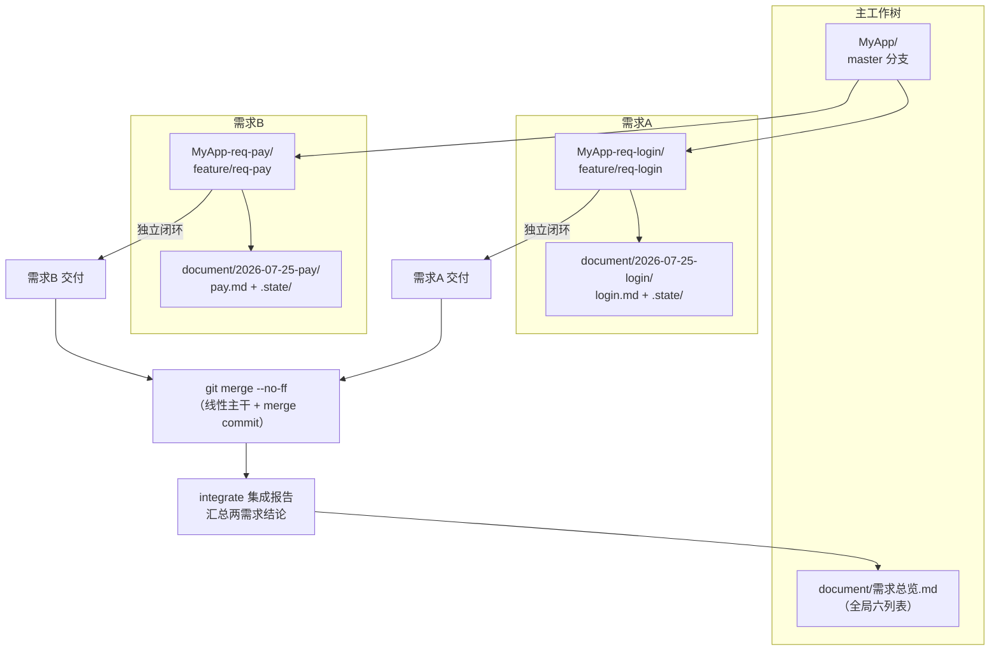
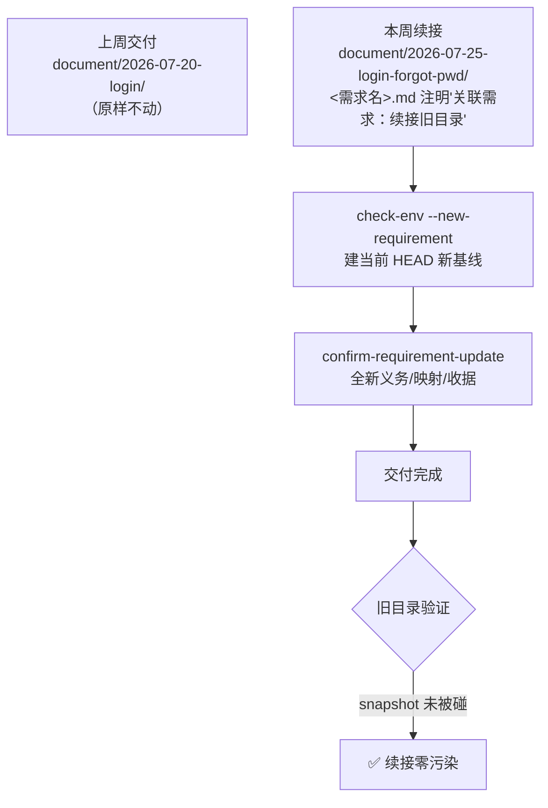
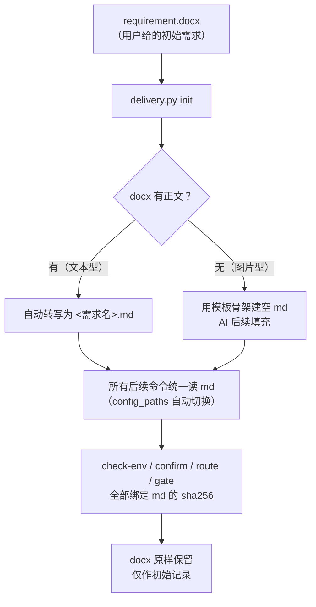

# Android Delivery Skills 完整流程图

> 每个阶段 = 简述 + 流程图 + 怎么执行（你做什么/AI 做什么/你看什么/命令），一体看完。

## 角色分工

| 角色 | 干什么 |
|---|---|
| **你（用户）** | 说需求 → 确认需求 → 确认计划 → 要求最终交付 |
| **AI** | 执行脚本命令 → 改代码 → 改测试 → 写文档 → 跑回归 → 报告 |
| **脚本** | 校验门禁 → 刷新 md → 标 STALE → 拦 gate（不合规就拦） |

执行环境：`cd /Users/example/work/MyPython/ai-skills/android-delivery-skills`，每条命令带 `--config profiles/<需求>.yaml`。

---

## 一、五步总览

> 用户始终只看到五步，内部三阶段（需求确认→计划→最终交付）隐藏在后。增量不推倒重来，最终交付只在用户明确要求时触发。



---

## 二、阶段一：确认需求与基线

> 读需求（docx 自动转 md），反复沟通确认（每答案先写回 md），纯确认后建 Git 基线 + 需求快照。confirm 成功后自动刷新续接指南/修订说明/映射说明。



### 怎么执行

**你做什么**：把需求文档（docx/md）放进 `document/<日期-英文名>/` 目录，告诉 AI 开始。补充/纠正需求后等 AI 复述理解，纯确认（不带新变化）后才推进。

**AI 做什么**：
1. 跑 `init` 读需求（docx 自动转 md），读代码分析影响面，输出"当前需求理解"给你看
2. 你补充/纠正 → AI 改 md → 重新 `init` 读 → 再给你看变化摘要
3. 反复直到你纯确认
4. 跑 `check-env`：校验分支 + 代码工作区干净（文档改动不拦）→ 建 Git 基线
5. AI 把你确认的义务写成 `requirement-revision.json` → 跑 `confirm-requirement-update`
6. 机器自动：版本号从"初始"变成"首次确认"，刷新续接指南/需求修订说明/测试映射说明

**你看什么**：终端输出"需求修订已确认：xxx 首次确认"，续接指南显示当前义务清单。

```bash
python3 scripts/delivery.py init --config profiles/<需求>.yaml
python3 scripts/delivery.py check-env --config profiles/<需求>.yaml
python3 scripts/delivery.py confirm-requirement-update --config profiles/<需求>.yaml
```

---

## 三、阶段二：拆分测试、确认计划与实现

> 生成测试映射骨架→AI 填测试→写实施计划（5 必需标题）→confirm-plan 生成收据→编码。编码中需求变了→增量闭环全自动（见第五节）。



### 怎么执行

**你做什么**：看计划摘要 → 说"确认" → AI 才开始编码。

**AI 做什么**：
1. 跑 `init-test-mapping` 生成测试映射骨架（每个义务标 STALE）
2. 填 `test_ids`，回填 `CURRENT`
3. 写 `实施计划.md`（必须含 5 个标题：实现范围/已上线业务影响/预计修改文件/测试方案/明确不修改范围）
4. 跑 `confirm-plan` 生成收据（绑定需求+计划 sha256，变了自动失效）
5. 开始编码：按一个原子 Then 做 Red → 最小实现 → Green，做完一个做下一个

**你看什么**：终端输出"实施计划已确认…你已获准开始编码"。

```bash
python3 scripts/delivery.py init-test-mapping --config profiles/<需求>.yaml
# AI 写实施计划.md
python3 scripts/delivery.py confirm-plan --config profiles/<需求>.yaml
# AI 编码 + 回填 CURRENT
```

---

## 四、阶段三：最终审查与交付

> route 路由专项→构建/Lint/JUnit/变异测试/证据→delivery_gate 全量校验→出结论（FULL_PASS/LOCAL_PASS/INCOMPLETE/BLOCKED）。



### 怎么执行

**你做什么**：说"最终检查"或"完整交付"或"准备提交"。

**AI 做什么**：
1. 跑 `route`：基于真实 diff 路由专项审查（Diff/质量/稳定性/API/UI）
2. 跑构建 + Lint + JUnit + 变异测试(PIT) + Journey 或人工证据
3. 跑 `delivery_gate validate`：全量校验义务集合/sha256/STALE/变异/traceability
4. 输出中文交付结论（FULL_PASS / LOCAL_PASS / INCOMPLETE / BLOCKED）

**你看什么**：终端输出结论 + `交付结论.md`（强制含"未验证项"和"残留风险"段）。

```bash
python3 scripts/delivery.py route --config profiles/<需求>.yaml
python3 scripts/delivery_gate.py validate --config profiles/<需求>.yaml
```

---

## 五、增量闭环（需求增量后全自动）

> 你/AI 改需求→confirm 一个命令→机器自动标 STALE+刷新 md+旧计划失效→AI 自动改代码+改测试+回填+增量回归+报告。整个过程不用你发额外命令。



### 怎么执行

**你做什么**：说"加一个 xxx 功能"或"改一下 xxx"。

**AI 做什么**：
1. 改 `<需求名>.md`（写回需求）
2. 物化修订清单 → 跑 `confirm-requirement-update`（一个命令）
3. 机器自动：版本号+1 → 变化义务标 STALE → 刷新所有 md → 旧计划失效
4. AI 自动闭环（不等用户）：① 改实现代码 ② 改测试代码 ③ 回填 CURRENT ④ 跑增量回归（含旧测试） ⑤ 报告

**你看什么**：续接指南"波及清单"显示改了哪些义务，AI 报告增量完成。

```bash
# AI 改 <需求名>.md + 物化修订清单后
python3 scripts/delivery.py confirm-requirement-update --config profiles/<需求>.yaml
# 后面 AI 全自动完成，不用你再发命令
```

---

## 六、STALE 联动机制（防改需求不更新测试）

> 需求改了某个义务→它的 sha256 变了→机器自动标 STALE→续接指南/映射说明同步→gate 拦不放行。AI 看到后自动改测试+回填→gate 放行。这就是"防 AI 改需求不更新测试"的机器兜底。



### 怎么执行

这个机制是**自动触发的**，你不需要做任何事。它发生在阶段二/五的 `confirm-requirement-update` 之后，机器自动标 STALE，AI 自动改测试+回填。你只在续接指南里看到"⏳ 测试待回填"→ AI 改完后变成"✅ 测试已对齐"。

---

## 七、多需求并行（git worktree）

> 每个需求一个 worktree + 独立分支 + 独立 profile + 独立 document 目录。各窗口独立闭环互不干扰。合并用 merge --no-ff。integrate 汇总结论到主工作树总览。



### 怎么执行

**你做什么**：开多个 Claude Code 窗口，每个窗口一个需求。

**AI 做什么**：每个窗口独立走阶段一→二→三，各用各的 profile + worktree。完成后合并到主分支。

```bash
# 每个窗口各自
python3 scripts/delivery.py init --config profiles/req-login.yaml
# ... 独立走完全流程 ...

# 全部交付后合并
git merge --no-ff feature/req-login -m "集成：req-login"
git merge --no-ff feature/req-pay -m "集成：req-pay"
# 汇总结论
python3 scripts/requirement_workspace.py integrate \
  --main-worktree MyApp --channels <req-a-dir>,<req-b-dir> --batch 2026-07-25-批次1
```

---

## 八、续接旧需求（新目录 + 引用）

> 续接不往旧目录塞内容（会冲突）。新建独立目录 + 引用旧需求 + 建当前 HEAD 新基线。旧目录原样不动，零污染。



### 怎么执行

**你做什么**：说"继续做 xxx 需求，加 yyy"。

**AI 做什么**：
1. 新建 `document/<新日期>-<英文名>/` 目录（不碰旧目录）
2. `<需求名>.md` 顶部注明"关联需求：续接 <旧目录>"
3. 跑 `init` + `check-env --new-requirement`（建当前 HEAD 新基线，不复用旧基线）
4. 后续和正常需求一样走

**你看什么**：旧目录原样不动（零污染），新目录全新独立。

```bash
python3 scripts/delivery.py init --config profiles/<新需求>.yaml
python3 scripts/delivery.py check-env --new-requirement --config profiles/<新需求>.yaml
```

---

## 九、docx → md 事实源切换

> 用户给 docx→init 自动转写为 <需求名>.md→以后所有命令统一读 md（config_paths 自动切换，无断裂）。图片型 docx 用模板骨架建空 md。docx 原样保留仅作初始记录。



### 怎么执行

**你做什么**：把 docx 放进 `document/<日期-英文名>/` 目录，配 profile 的 `requirement_file: requirement.docx`。

**AI 做什么**：跑 `init` 时自动读 docx 正文，转写成 `<需求名>.md`。以后所有命令（check-env/confirm/route/gate）自动读 md（config_paths 统一切换）。图片型 docx 用模板骨架建空 md，AI 在后续沟通中填充。

**你看什么**：终端输出"已自动读取 docx 并转写为 xxx.md（事实源）"，后续增量都在 md 上改。
