# Android Delivery Skills 当前流程图

> 本文是 [FLOW_OVERVIEW.md](FLOW_OVERVIEW.md) 的图形索引，只描述当前轻量流程，不代表额外状态机或脚本门禁。

## 目录

0. [陌生项目首次接手](#diagram-onboarding)
1. [完整主流程](#diagram-main)
2. [需求模糊时的决策树前沿](#diagram-clarify)
3. [Figma 与 API 输入](#diagram-inputs)
4. [纵向切片与紧反馈](#diagram-feedback)
5. [增量变化分流](#diagram-incremental)
6. [最终验证路由](#diagram-final)
7. [多需求并行](#diagram-parallel)
   1. [合并规则（git worktree）](#diagram-merge)
8. [新窗口恢复](#diagram-resume)
9. [文档与代码落点](#diagram-layout)

## 零、陌生项目首次接手

陌生项目接手是具体需求主流程之前的窄入口，不改变原交付流程。只清理进入当前需求所需的知识缺口；接手结果不能替代需求规格和验收证据。

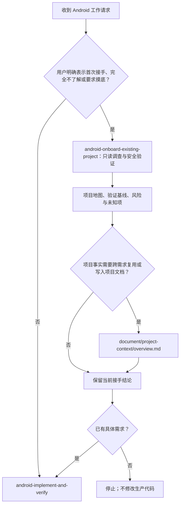

## 一、完整主流程

图中展示正常推进路径；任意节点均可进入 [增量闭环](#diagram-incremental)，收拢后回到受影响工作，不必从头重走。

流程说明：

1. 先读取项目、需求配置、Git、代码、测试和 UI/API 来源；已有改动先由用户在原工作区保存、提交或隔离，建立独立干净工作区后才记录基线，缺失引用则让用户决定来源。
2. 只澄清会改变行为、范围或验收的问题；未知清空后才形成一份 `draft spec.md`。
3. 用户确认最新完整规格后改为 `confirmed`，先形成 `SPEC` 边界提交并恢复干净工作区；小需求按 `BDD-##`、复杂需求按 `SLICE-##` 逐个完成纵向切片。
4. 每个切片只跑受影响验证，审查完整工作区后自动形成原子提交。
5. 用户明确要求最终交付时才完整验证并审计 `baseline_commit...HEAD`；推送、集成和发布仍分别需要用户授权。

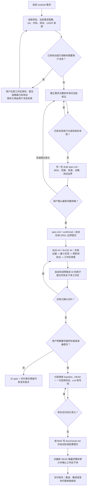

## 二、需求模糊时的决策树前沿

流程说明：

1. Agent 先查代码、文件和链接，能自行证明的事实不转问用户。
2. 把真正需要产品决定的问题组织成决策树，每轮只处理前置条件已明确的当前前沿。
3. 同一轮列出全部互不依赖问题；用户可以回答其中一个、多个或同时纠正旧需求。
4. 完整吸收本轮变化后重新计算前沿，不重复已解决问题，也不丢失未回答问题。
5. `待确认` 非空时不新增或改写任何 BDD，保留已有且未受影响的 BDD；清空后补齐 BDD 与计划验证，再请求规格确认，确认后才进入实现。

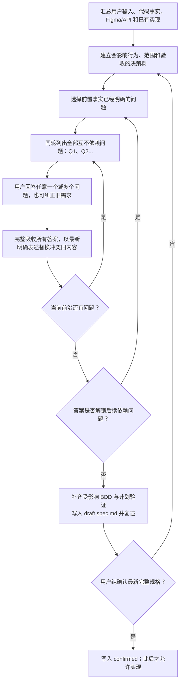

## 三、Figma 与 API 输入

流程说明：

1. 链接、截图、导出文件、文档和聊天都是有效输入，但只记录实际可证明的内容。
2. Figma 输入先确认 XML View 或 Compose；XML 页面在规格确认后调用 `figma-android-xml`。
3. 生成 XML、构建 APK 或页面能打开都不代表 UI 通过，仍需真实截图和交互验收。
4. API 输入立即创建或增量更新唯一 `api/api.md`，并与需要留存的原始资料共置。
5. 来源冲突或未知会改变 DTO、序列化、业务行为或验收时询问用户，不自行猜测。

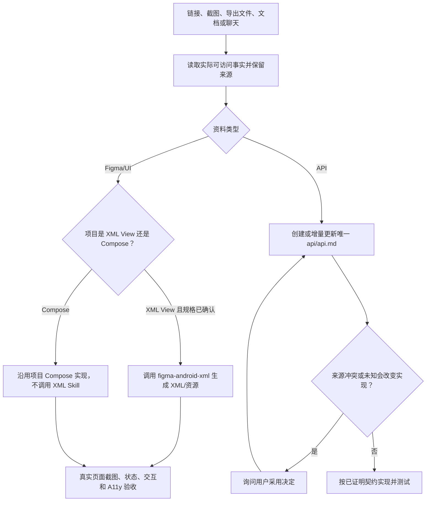

## 四、纵向切片与紧反馈

流程说明：

1. Agent 根据交付结果、必要上下文和验证边界决定整体交付或显式切片；紧密相关的多条 BDD 可一起交付，需分组或依赖计划时使用 `SLICE-##`，不按数量、行数或累计 Token 判大小。
2. 每个边界内逐条确认测试因缺少目标行为而失败，再编写最小实现使其通过。
3. 当前测试转绿后只追加直接受影响模块测试和必要编译，再审查 staged、unstaged 和 untracked 内容。
4. 自动形成一个中文语义原子提交，工作区重新干净后才能默认进入下一切片；整片取消/替代按增量闭环收拢。
5. 疑难 Bug、偶发故障和性能回归先建立紧反馈入口，再最小化失败；偶发问题用固定轮次统计复现率。
6. 修复前通常列出 2–5 个有依据的可证伪假设；仅有一个合理候选时记录排除依据、不凑数，再用单假设、单变量探针证伪。
7. 无法复现或同一根因连续三轮没有进展时，报告证据和阻塞条件，不猜因修改。

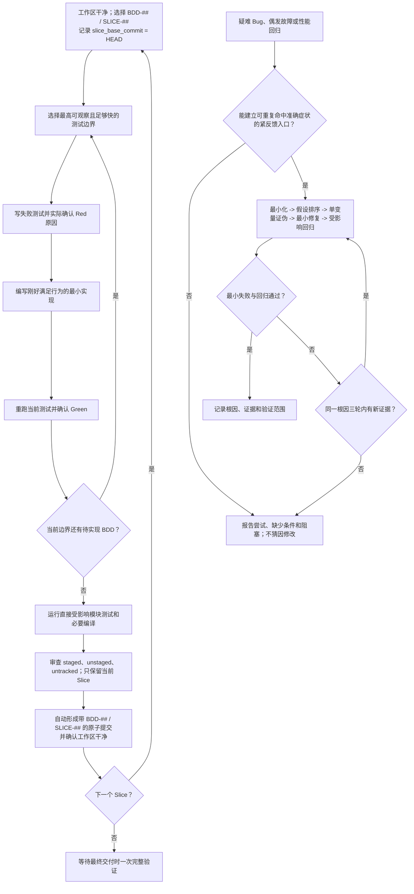

## 五、增量变化分流

流程说明：

本图可从任意阶段进入，不受当前检查是否通过限制；只读或授权不足时仅评估并报告。输入提交、同片续接、取消/替代和重验的门禁统一见 [增量闭环](../android-implement-and-verify/references/implement-and-test.md#incremental-loop)。

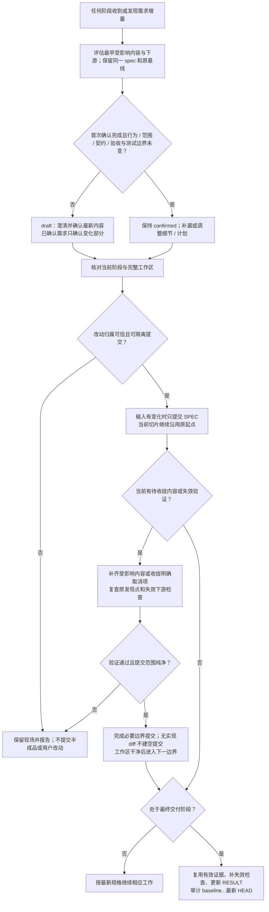

## 六、最终验证路由

流程说明：

1. 只有用户明确要求最终检查、完整交付或准备提交时才进入最终验证。
2. 先确认基线仍是 `HEAD` 的祖先且工作区干净，再读取 stat、name-status 和提交历史，按 `BDD-##`、`SLICE-##` 或 `MIGRATE-*` 审查；单段仍过大时按模块、文件和 hunk 分块并从清单逐项销账，最后做整体一致性审计。
3. 复用命令、variant/设备环境和被验证输入均未变化的证据，只补缺失或失效的完整测试、构建、Lint 与专项。
4. 修复改变代码后重新执行受影响验证；空测试、全部 skipped 和旧报告不能支持通过。
5. 范围可信、验证实际执行且工作区除结果外干净时，把通过、部分通过或失败如实写入 `docs/result.md` 并形成 `RESULT` 提交，再对最新 `HEAD` 完成最终审计；结果提交不夹带构建产物、原始大日志、敏感信息、本机绝对路径或无关截图。

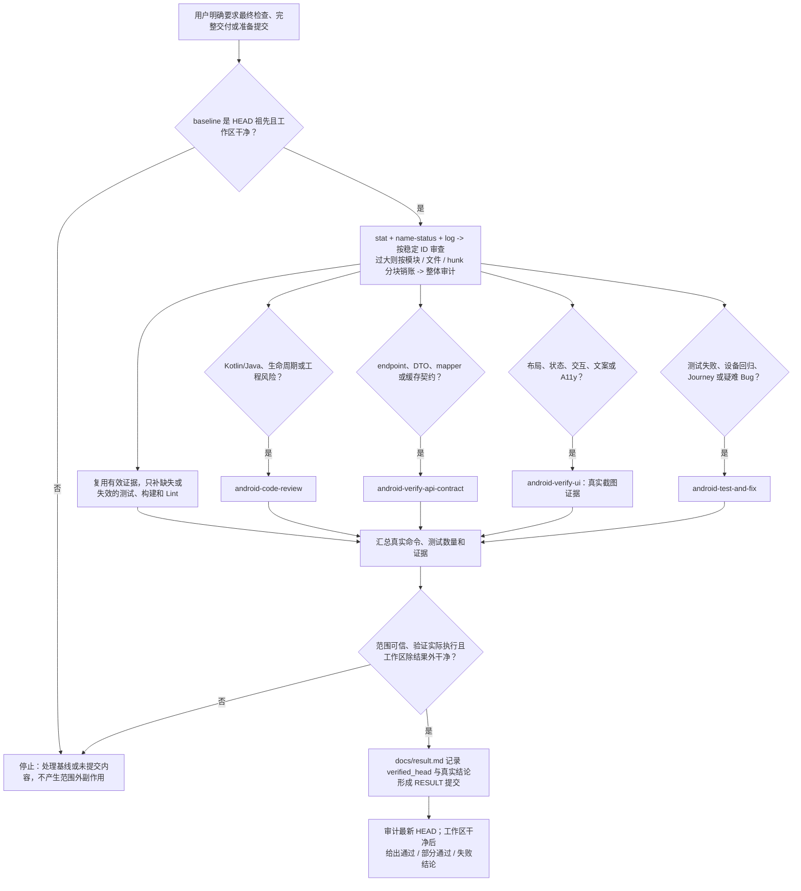

## 七、多需求并行

流程说明：

1. 只有互不冲突且可独立验收的需求进入并行；存在代码写入冲突或业务依赖时顺序完成。
2. 每个并行需求使用独立 worktree、分支、配置和日期格式 `requirement_dir`。
3. 每个窗口维护自己的 `spec.md`、代码和测试结果，不共享 `profiles/local.yaml` 或其他需求证据。
4. 模拟器、真机、账号和不可并发后端数据仍作为共享资源串行使用。
5. 大需求默认保持一份规格，以 `BDD-##` / `SLICE-##` 原子提交作为上下文检查点，不创建第二份 Tickets；宽范围迁移使用带 `MIGRATE-EXPAND`、`MIGRATE-##` 和 `MIGRATE-CONTRACT` 稳定 ID 的 expand-migrate-contract，并在 Contract 前核对实际发布兼容边界。

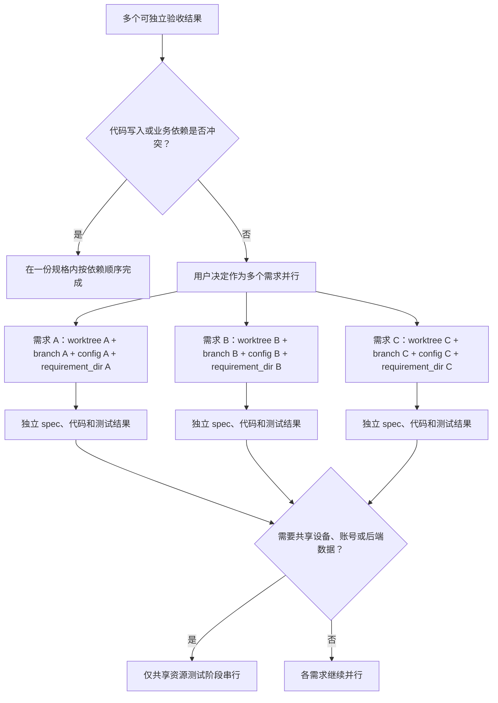

### 合并规则（git worktree）

合并规则说明：

1. 各需求先在自己的 worktree、分支和配置中完成实现与验证；用户未授权集成时保持等待。
2. 每次只处理一个需求分支：先把它 rebase 到最新目标分支，不能用旧基线直接合并。
3. 发生冲突时先读取双方规格、相关代码、调用方和测试；兼容意图同时保留，不兼容时由用户决定。
4. rebase 后先跑受影响验证，再在目标 worktree 使用 `git merge --ff-only`；不能 fast-forward 时停止并重新核对目标分支。
5. 每次合入后都在集成代码上重跑受影响验证；还有其他需求时，以更新后的目标分支重复同一流程。
6. 不静默改用 merge commit、改写目标分支历史，也不拿需求分支上的旧结果证明最终集成代码。

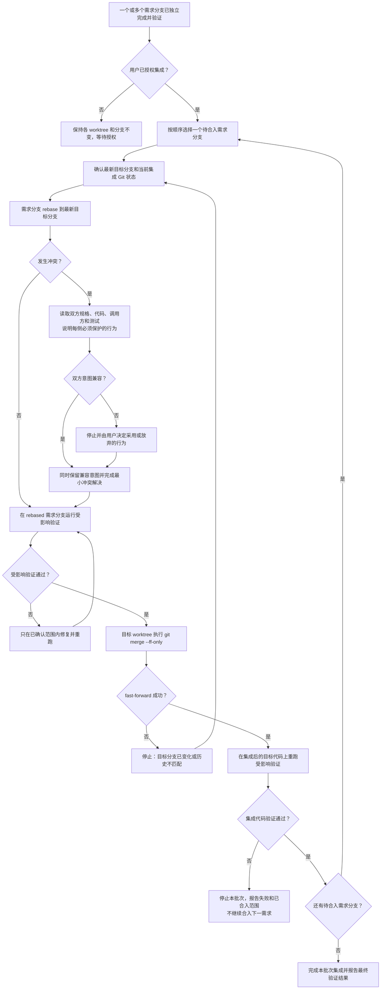

## 八、新窗口恢复

流程说明：

1. 新窗口先读取本总览、当前需求自己的配置、项目 `AGENTS.md` 和 Git 状态。
2. 配置已有 `requirement_dir` 时直接复用；没有时先复用唯一同名日期目录，多个候选由用户选择，没有匹配才按首次启动日期创建并写回。
3. 优先读取 `docs/spec.md`；旧目录只有唯一 `docs/<requirement_name>.md` 时把它作为兼容规格源，再一并读取 `api/api.md`、已有 `docs/result.md` 和 `baseline_commit..HEAD` 的边界提交。
4. `baseline_commit` 不再是当前历史祖先时停止 diff 比较，由用户决定新的审查起点。
5. 用提交标题中的 `BDD-##`、`SLICE-##` 或 `MIGRATE-*` 定位，核对最新规格、实际代码、后续修复或回退和有效证据后恢复进度；旧 ID 或 RESULT 不能单独证明完成。未提交切片按增量闭环证明归属、授权和原起点后续接。

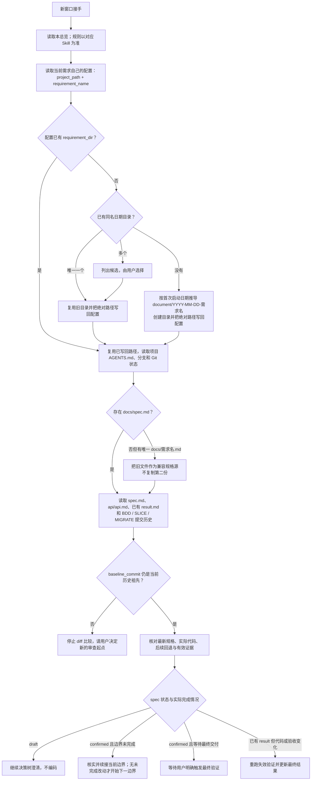

## 九、文档与代码落点

流程说明：

1. 陌生项目接手上下文需要持久化时放在 `document/project-context/overview.md`，与日期需求目录并列。
2. 当前需求配置首次只需要 `project_path + requirement_name`，Agent 推导日期目录并写回 `requirement_dir`。
3. 新需求由 `docs/spec.md` 保存唯一需求事实；旧目录可沿用唯一 `docs/<requirement_name>.md`，但不得复制第二份；`docs/result.md` 只保存最终执行结果。
4. API 契约和原始资料放 `api/`，UI 设计导出和验收截图按需放 `ui/`。
5. Journey XML 由 Agent 根据已确认 BDD 创建在 `test-cases/journeys/<作用域>/`。
6. 生产代码、资源和普通自动化测试仍放 Android 项目既有目录，需求目录不保存实现副本。

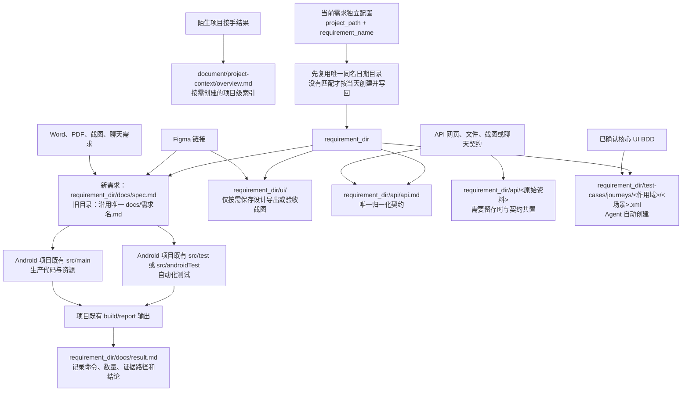
