# Android Delivery Skills 完整流程图

<!-- android-delivery-flow:generated:start -->
## 自动同步的状态机

> 由结构化流程契约生成；契约摘要 `6349db7c7eec31a7ebd3c6dab61cd538f8d3dd3dd6d73cb466285e7b51271dd7`。增量更新是跨阶段回退，不是可跳过的线性尾声。

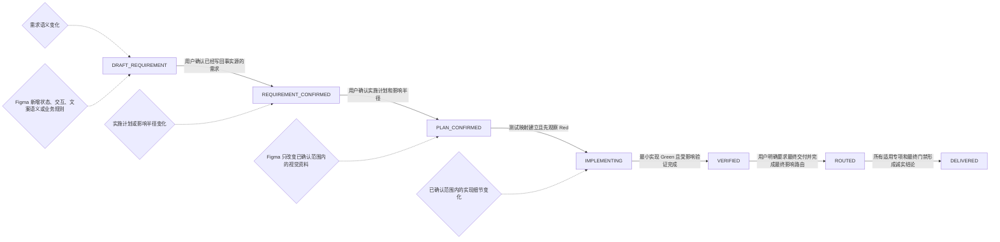

<!-- android-delivery-flow:generated:end -->


> 每个阶段 = 简述 + 流程图 + 怎么执行（你做什么/AI 做什么/你看什么/命令），一体看完。
> 本文同步 [FLOW_OVERVIEW.md](./FLOW_OVERVIEW.md) 的仓库、命令、产物、门禁和维护信息；流程图以当前 Skill 和脚本实现为准。
> 当前事实源：`docs/<需求名>.md`；维护验证入口：`python3 scripts/validate_maintenance.py`，结果以当次输出为准。
> 具体业务说明、产物清单、门禁细则和脚本职责见 `FLOW_OVERVIEW.md`；本文只承载可视化流程和图旁的最小执行说明。
> 状态语义：`STALE` = 已失效、待重新回填；`CURRENT` = 已与当前需求义务和测试结果对齐。

## 目录

1. [角色分工](#fd-roles)
2. [一、五步总览](#fd-overview)
3. [二、阶段一：确认需求与基线](#fd-stage-one)
4. [三、阶段二：拆分测试、确认计划与实现](#fd-stage-two)
5. [四、阶段三：测试执行](#fd-stage-three)
6. [五、阶段四：最终交付](#fd-stage-four)
7. [六、增量闭环](#fd-incremental)
8. [七、STALE（已失效待重新回填）联动机制](#fd-stale)
9. [八、多需求并行](#fd-parallel)
10. [九、开始下一个独立需求](#fd-resume)
11. [十、docx → md 事实源切换](#fd-docx)

<a id="fd-roles"></a>
## 角色分工

| 角色 | 干什么 |
|---|---|
| **你（用户）** | 说需求 → 确认需求 → 确认计划 → 要求最终交付 |
| **AI** | 执行脚本命令 → 改代码 → 改测试 → 写文档 → 跑回归 → 报告 |
| **脚本** | 校验门禁 → 刷新 md → 标记 `STALE`（已失效，待回填）→ 拦 gate |

执行环境：在仓库的 `ai-skills/android-delivery-skills/` 目录执行，每条命令带 `--config profiles/<需求>.yaml`。

---

<a id="fd-overview"></a>
## 一、五步总览

### 五步总览摘要

1. **用户看到五步**：确认需求、拆分测试与确认计划、实现验证、变更后增量循环、最终交付。
2. **内部执行四阶段**：需求确认、计划与实现、测试执行、最终交付；技术细节不改变用户可见流程。
3. **变化统一回流**：任何阶段发现需求漏洞都先写回需求事实源；计划或影响半径变化时重新展示并等待用户确认。

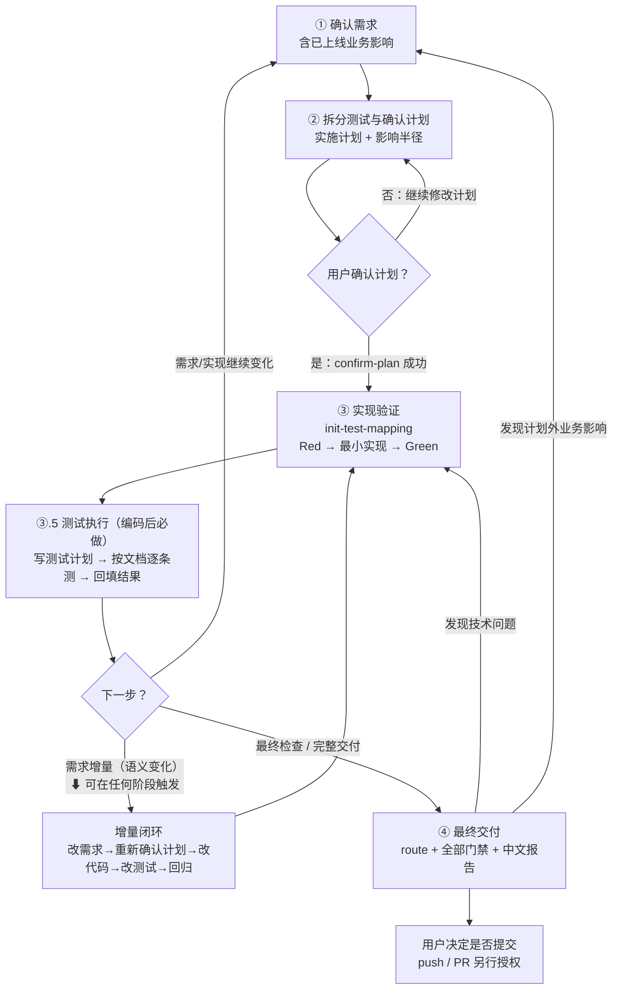

1. **确认需求**：先综合已知资料并区分事实、决定、推导和假设；资料足够时不重复提问。每个接受的答案写回唯一需求文件，纯确认后进入计划准备。
2. **拆分测试与确认计划**：把行为映射为测试；复杂需求在同一计划中按可独立验证结果纵向拆分，小需求一行直通。`confirm-plan` 核对 BDD、预期文件和测试与影响半径对应，用户确认后才能编码。
3. **实现验证**：按一个可观察行为完成 Red → 最小实现 → Green，只报告本轮实现和验证结果。
4. **变更后增量循环**：需求增量后自动改需求、计划、代码、测试、证据并执行受影响回归。
5. **最终交付**：只有用户明确要求时，才基于最终 diff 执行完整审查、回归、构建、Lint、条件专项和中文报告。

---

<a id="fd-stage-one"></a>
## 二、阶段一：确认需求与基线

### 阶段一摘要

1. **读取事实源**：执行 `init`，优先读取 `docs/<需求名>.md`；没有 md 时才把 docx 转写为 md。
2. **确认业务边界**：分析相关代码和测试，展示已上线业务影响、BDD、主流程和异常边界；用户补充内容先写回需求文件。
3. **建立确认基线**：用户纯确认后执行 `check-env`，再执行 `confirm-requirement-update`，形成当前需求版本和 Git 基线。
4. **刷新机器产物**：自动更新续接指南、修订说明、测试映射说明和需求测试追溯；需求事实确认后才能进入阶段二。

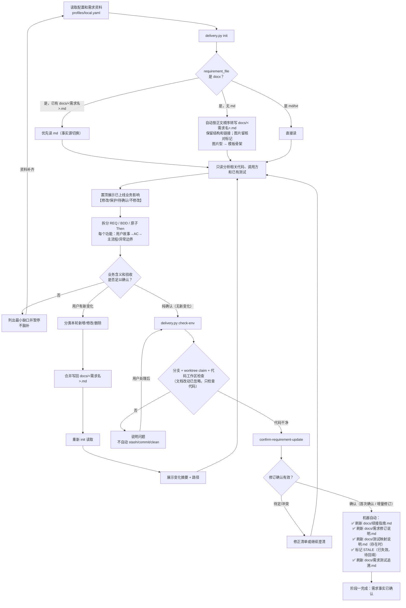

### 怎么执行

**你做什么**：把需求文档（docx/md）放进当前 profile 的 `requirement_dir`；项目内通道通常是 `document/<日期-英文名>/`，本机串行通道由 `requirement_workspace.py next` 创建。告诉 AI 开始后，补充/纠正需求并等待 AI 复述理解，纯确认（不带新变化）后才推进。

**AI 做什么**：
1. 跑 `init` 读需求（docx 自动转 `docs/<需求名>.md`），读代码分析影响面，输出"当前需求理解"给你看
2. 你补充/纠正 → AI 改 `docs/<需求名>.md` → 重新 `init` 读 → 再给你看变化摘要
3. 反复直到你纯确认
4. 跑 `check-env`：校验分支、原子占用当前物理 worktree 和代码工作区干净（文档改动不拦）→ 建 Git 基线
5. AI 把你确认的义务写成 `requirement-revision.json` → 跑 `confirm-requirement-update`
6. 机器自动：版本号从"初始"变成"首次确认"，刷新 `docs/` 下的人读追溯视图

**你看什么**：终端输出"需求修订已确认：xxx 首次确认"，续接指南显示当前义务清单。

```bash
python3 scripts/delivery.py init --config profiles/<需求>.yaml
python3 scripts/delivery.py check-env --config profiles/<需求>.yaml
python3 scripts/delivery.py confirm-requirement-update --config profiles/<需求>.yaml
```

---

<a id="fd-stage-two"></a>
## 三、阶段二：拆分测试、确认计划与实现

### 阶段二摘要

1. **定义实施边界**：编写 `docs/实施计划.md` 和 `test-cases/impact-radius.json`，登记 BDD、预期文件、预期测试和明确不修改范围；复杂需求只在计划中纵向拆分，小需求不增加产物。
2. **确认计划**：展示计划和影响半径，用户确认后执行 `confirm-plan`，生成绑定需求、计划和影响半径的收据。
3. **建立测试映射**：执行 `init-test-mapping`，登记真实测试 ID 和业务断言，先确认 Red，再按原子 Then 做最小实现和 Green。
4. **处理需求变化**：验收语义变化时先更新需求、计划和影响半径，重新确认后再重建映射和继续实现。

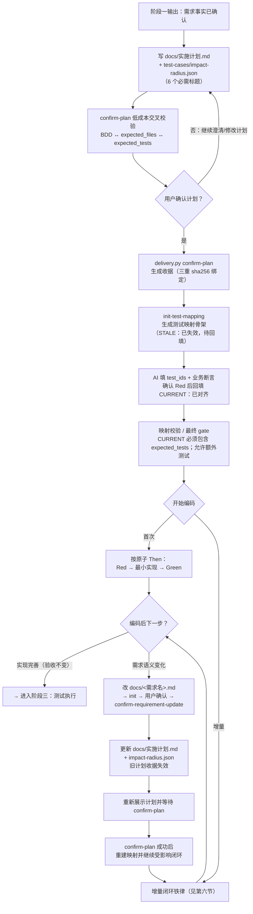

### 怎么执行

**你做什么**：看计划摘要和影响半径 → 说"确认" → AI 才能执行 `confirm-plan` 并开始编码。

**AI 做什么**：
1. 写 `docs/实施计划.md` 和 `test-cases/impact-radius.json`（计划必须含六个标题，并让 BDD、预期文件、预期测试相互对应）
2. 展示计划和影响半径，等待你确认
3. 跑 `confirm-plan` 生成收据（绑定需求、计划和影响半径 sha256）
4. 跑 `init-test-mapping`，填 `test_ids`，使 `CURRENT` 映射包含 `expected_tests`，再用业务断言确认 Red；人工验收时保留空 `expected_tests` 并填写原因
5. 开始编码：按一个原子 Then 做 Red → 最小实现 → Green，做完一个做下一个

**你看什么**：终端输出"实施计划已确认…你已获准开始编码"。

```bash
# AI 先写 docs/实施计划.md + test-cases/impact-radius.json，并展示等待确认
python3 scripts/delivery.py confirm-plan --config profiles/<需求>.yaml
python3 scripts/delivery.py init-test-mapping --config profiles/<需求>.yaml
# AI 先确认 Red，再编码并回填 CURRENT
```

---

<a id="fd-stage-three"></a>
## 四、阶段三：测试执行（编码后、route 前的必做环节）

### 阶段三摘要

1. **准备真实测试载体**：确认或生成 Unit、集成、插桩测试、Journey XML 或人工验收记录，并登记到测试映射。
2. **选择适用验证层**：按 BDD、影响半径和风险选择测试、构建、Lint、安装、Journey、截图、日志或人工验收，不机械执行无关长链路。
3. **收集真实证据**：保存执行收据、JUnit/XML/SARIF、Journey 结果和必要的人读摘要；`docs/测试结果.md` 不作为机器事实源。
4. **完成诚实结果**：每个 BDD 都有 `PASS`、`FAIL` 或明确 `UNVERIFIED`，UI 验收先完成物理设备预检。
5. **发现需求漏洞**：停止当前验证，进入增量闭环；所有场景有结果后才能进入阶段四的 `route + gate`。

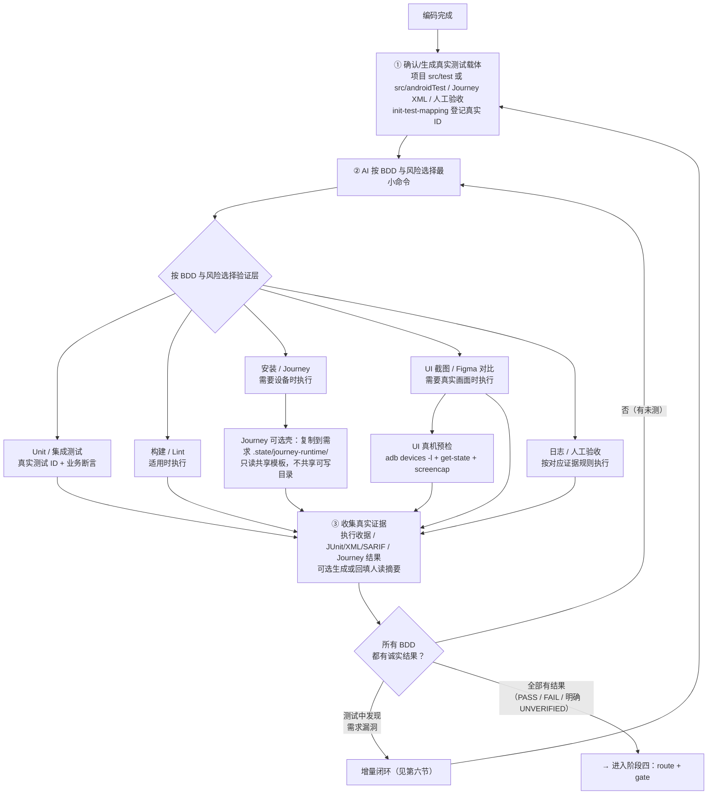

### 怎么执行

**你做什么**：等 AI 完成测试执行并报告结果。如果测试中发现需求遗漏，补充需求后按第六节先确认需求和计划，再继续受影响闭环。

**AI 做什么**：
1. 根据 BDD、实际 diff 和项目结构创建或更新真实测试代码、Journey XML 或人工验收记录；执行 `init-test-mapping` 登记真实测试 ID，并核对 `CURRENT` 映射包含影响半径的 `expected_tests`，允许额外测试
2. 按 BDD、影响半径和实际影响类别直接选择并执行最小验证：Unit、集成、构建、Lint、安装、Journey、截图、日志或人工验收；不机械运行不适用的长链路
3. 可选回填 `docs/测试结果.md` 人读摘要（命令、退出码、测试数、收据/报告、PASS/FAIL/UNVERIFIED 和未验证原因）；内容必须来自真实证据
4. 让机器映射和覆盖结论绑定真实收据；测试步骤保留在测试代码或 Journey XML 中，机器 gate 不以人读摘要单独判定通过
5. 如果测试中发现需求漏洞 → 触发增量闭环（改需求→改代码→改测试→改文档→重测）

测试代码落盘规则：

1. Unit/JVM 测试写入 `<project_path>/<module>/src/test/java/` 或 `<project_path>/<module>/src/test/kotlin/`。
2. Android 插桩测试写入 `<project_path>/<module>/src/androidTest/java/` 或 `<project_path>/<module>/src/androidTest/kotlin/`。
3. 变体 source set 或自定义测试目录只沿用项目已有约定；`test-cases/` 只保存映射、修订、影响半径和 Journey XML。

Journey 运行时补充规则：

1. 正式 XML 读取 `<requirement_dir>/test-cases/journeys/<需求作用域>/`。
2. 可选壳复制到 `<requirement_dir>/.state/journey-runtime/<scope-key>/` 后才允许发现任务、暂存 XML、构建和收集报告。
3. `$XDG_CACHE_HOME/android-delivery-skills/gradle/`（默认 `~/.cache/android-delivery-skills/gradle/`）只放共享 Gradle 依赖缓存，不放用例、构建产物或最终证据。
4. 需求目录位于目标项目 worktree 内时，`check-env`/Journey 自动登记项目 Git 的 `<git-common-dir>/info/exclude`；只排除 `.state/` 机器状态，不排除正式文档、测试用例和最终报告。

**你看什么**：可选的 `docs/测试结果.md` 人读摘要，以及最终自动生成的 `docs/交付结论.md`；机器事实仍以执行收据、JUnit/XML/SARIF、Journey 结果和 `delivery-result.json` 为准，具体测试步骤看测试代码或 Journey XML。

```bash
# AI 先确认真实测试代码或 Journey XML，再按 BDD 和风险直接选择适用命令
# 示例：具体测试任务、构建/Lint、设备 Journey 或人工验收由实施计划决定
# 普通自动化/人工业务结果绑定对应收据；UI 先完成物理设备预检，再回填 Figma、真机截图/差异图链接和动态说明
```

---

<a id="fd-stage-four"></a>
## 五、阶段四：最终交付（route + gate）

### 阶段四摘要

1. **进入阶段四**：阶段三所有场景已有真实结果后，执行 `delivery.py route`。
2. **route 校验与收敛**：校验需求、计划、影响半径和完整输入摘要；相同输入复用，输入变化按轮次推进，超过默认 3 轮标记 `BLOCKED`。
3. **影响复核与专项**：先执行 `android-review-diff`，再按 `specialist_tasks` 逐项执行专项；route 只登记任务，不直接调用 Skill。
4. **发现问题后的分流**：范围或需求问题进入增量闭环；代码或专项问题最小修复，改变 diff 后必须重新 route；只缺证据时局部补证和重验。
5. **最终验证与门禁**：完成必要回归并收集证据后，优先执行 `assemble --manifest`，不适用时手写结果再 `validate`。
6. **交付结果**：门禁根据实际证据输出 `FULL_PASS`、`LOCAL_PASS_DEVICE_PENDING`、`INCOMPLETE` 或 `BLOCKED`，最后由用户决定是否提交。

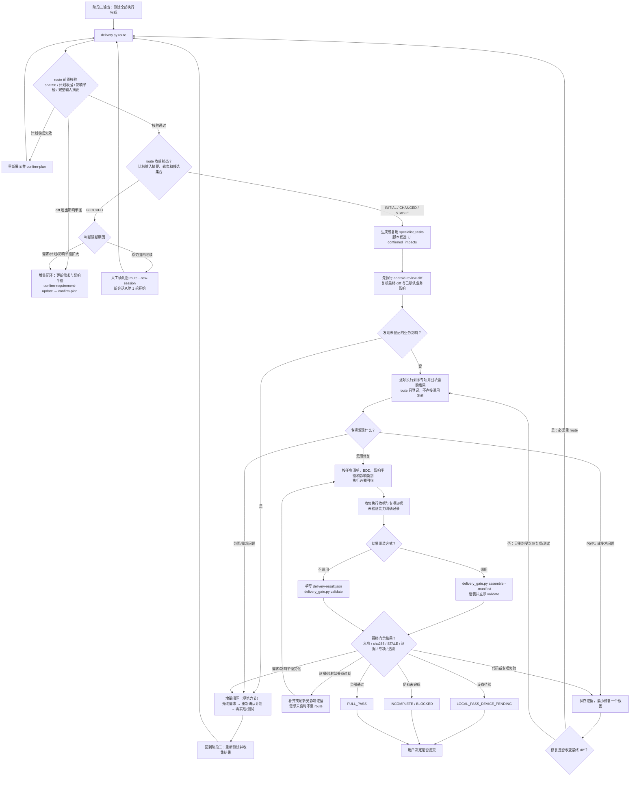

### 怎么执行

**你做什么**：说"最终检查"或"完整交付"或"准备提交"。

**AI 做什么**：
1. 跑 `route`：合并脚本路径候选和 Diff Reviewer 的 `confirmed_impacts`，生成 `.state/route-impact.json` 的 `specialist_tasks`
2. 按任务清单逐项执行专项并回填对应结果；route 本身不直接调用 Skill
3. 按 BDD、影响半径和实际影响类别执行自动化回归；没有可执行条件时明确标记未验证或阻塞
4. 根据产物清单优先跑 `delivery_gate.py assemble --manifest`，由中文交付门禁组装结果并立即校验
5. assemble 不适用时才手写 `delivery-result.json`，再跑 `delivery_gate.py validate`
6. 输出中文交付结论（FULL_PASS / LOCAL_PASS / INCOMPLETE / BLOCKED）

**你看什么**：终端输出结论 + `docs/交付结论.md`（强制含"未验证项"和"残留风险"段）。

```bash
python3 scripts/delivery.py route --config profiles/<需求>.yaml
# 相同 route 输入会复用；超过默认 3 个变化轮次后先人工判断，确认原范围内继续时：
# python3 scripts/delivery.py route --config profiles/<需求>.yaml --new-session
python3 scripts/delivery_gate.py assemble \
  --config profiles/<需求>.yaml --manifest <产物清单.yaml>
# 仅在 assemble 不适用且已手写 delivery-result.json 时：
# python3 scripts/delivery_gate.py validate --config profiles/<需求>.yaml
```

---

<a id="fd-incremental"></a>
## 六、增量闭环（任何阶段需求变更都触发）

### 增量闭环摘要

1. **发现变化**：在需求、计划、编码、测试、route 或 gate 任一阶段发现需求漏洞或语义变化。
2. **写回并确认需求**：更新唯一需求事实源，重新 `init`，等待用户确认后执行 `confirm-requirement-update`。
3. **更新并确认计划**：同步实施计划和影响半径，重新展示 BDD、预期文件和预期测试，等待 `confirm-plan` 成功。
4. **恢复实现链路**：重建测试映射，先确认 Red，再做最小实现、更新测试、回归和证据刷新。
5. **回到原阶段**：按发现变化的阶段继续；需求或影响半径变化后不得复用旧 route、旧测试结果或旧最终报告。

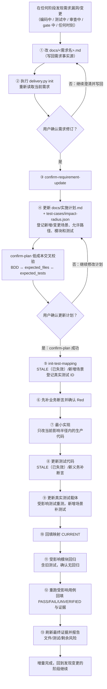

### 怎么执行

**你做什么**：在任何阶段说"加一个 xxx 功能"或"改一下 xxx"或"发现 xxx 没考虑"；看到更新后的需求和计划后，分别确认需求修订与计划边界。

**AI 做什么**：
1. 改 `docs/<需求名>.md`，执行 `init`，展示修订内容并等待用户确认
2. 物化修订清单，执行 `confirm-requirement-update`
3. 更新 `docs/实施计划.md` 和 `test-cases/impact-radius.json`，同步 BDD、预期文件和预期测试，展示变化并等待用户确认 `confirm-plan`
4. 执行 `init-test-mapping`，为 `STALE`（已失效）/新增场景补真实测试 ID 和业务断言，`CURRENT` 映射包含对应 `expected_tests` 后再确认 Red；人工验收保留空列表并填写原因
5. 只在当前影响半径内实现、更新真实测试载体、回填结果摘要和映射
6. 跑受影响模块回归和受影响用例，绑定新鲜执行收据、截图、日志或人工证据
7. 报告修改文件、测试结果和剩余风险；计划未确认前不得修改代码

**你看什么**：续接指南"波及清单"、更新后的 `docs/实施计划.md`、测试代码或 Journey XML、结果摘要和 AI 报告。

```bash
# AI 改 docs/<需求名>.md 后先重新 init，并展示修订内容等待确认
python3 scripts/delivery.py init --config profiles/<需求>.yaml
# 用户确认需求后，AI 物化修订清单并执行
python3 scripts/delivery.py confirm-requirement-update --config profiles/<需求>.yaml
# AI 更新 docs/实施计划.md + test-cases/impact-radius.json，展示并等待用户确认
python3 scripts/delivery.py confirm-plan --config profiles/<需求>.yaml
# 用户确认计划后，继续映射、Red、最小实现、回归和证据刷新
```

---

<a id="fd-stale"></a>
## 七、STALE（已失效，待重新回填）联动机制

### STALE 联动摘要

1. **需求义务变化**：需求修订后，义务摘要 sha256 发生变化。
2. **测试映射失效**：机器自动把受影响映射标为 `STALE`，旧测试结果不能继续证明当前义务。
3. **同步人读视图**：续接指南、映射说明和测试结果摘要同步显示待回填状态。
4. **确认后重新验证**：计划或影响半径变化时重新 `confirm-plan`，然后补测试、回填 `CURRENT` 并重测。
5. **门禁兜底**：`STALE` 未回填或证据不新鲜时，最终 gate 阻断通过。

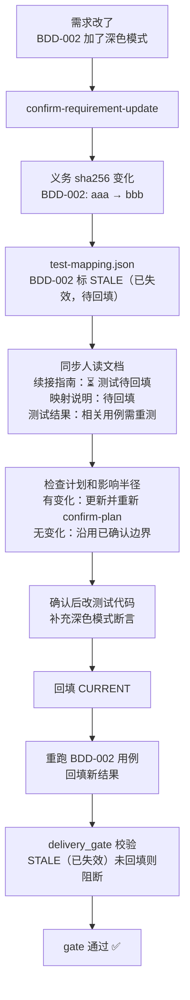

### 怎么执行

这个机制由 `confirm-requirement-update` 自动标记 `STALE`（已失效，待重新回填），但计划或影响半径变化时仍要先重新展示并等待用户确认。确认后，AI 才继续改测试、回填、重测和更新文档；你可在续接指南里看到“⏳ 测试待回填”→“✅ 测试已对齐”。

---

<a id="fd-parallel"></a>
## 八、多需求并行（git worktree）

### 并行协作摘要

1. **独立通道**：每个需求使用独立 worktree、分支、profile 和 document 目录。
2. **物理目录占用**：`check-env` 原子 claim 当前 worktree；同一物理目录被其他需求占用时阻断，不同 worktree 可以并行。
3. **独立闭环**：每个窗口独立完成需求、计划、实现、测试、route 和 gate，route 与 gate 持续复核当前 claim。
4. **单线合并**：私有分支合入前只做一次 `git rebase`，主分支使用 `git merge --ff-only`。
5. **合入后复验**：主分支合入后重新执行受影响门禁；`integrate` 只汇总结论和释放通道，不代替 Git 合并。

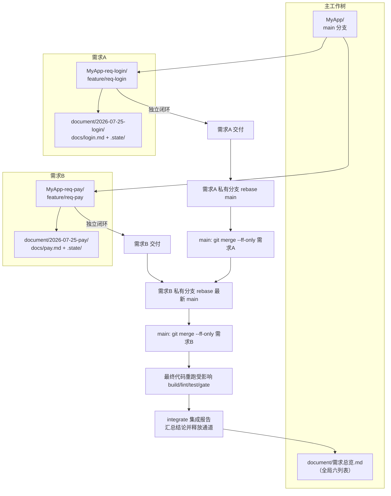

### 怎么执行

**你做什么**：开多个 Claude Code 窗口，每个窗口一个需求。

**AI 做什么**：每个窗口独立走阶段一→二→三→四，各用各的 profile + worktree。完成后按“rebase 私有分支 → 主分支 ff-only → 最终代码复验”合并；不同 worktree 的代码、基线、测试和证据互不覆盖。

```bash
# 每个窗口各自
python3 scripts/delivery.py init --config profiles/req-login.yaml
# ... 独立走完全流程 ...

# 每个私有分支在准备合入时，先基于最新主分支 rebase
git switch feature/req-login
git rebase main
git switch main
git merge --ff-only feature/req-login

# 主分支前进后，需求B再 rebase，避免 ff-only 失败
git switch feature/req-pay
git rebase main
git switch main
git merge --ff-only feature/req-pay

# 在最终主工作树代码上重新跑受影响门禁后，汇总结论并释放通道
python3 scripts/requirement_workspace.py integrate \
  --main-worktree MyApp --channels <req-a-dir>,<req-b-dir> --batch 2026-07-25-批次1
```

---

<a id="fd-resume"></a>
## 九、开始下一个独立需求

### 续接摘要

1. **仅用于本机串行轮换**：执行 `requirement_workspace.py next`，预览 `requirements-runtime/REQ-*` 新目录、旧目录状态和延迟回收结果；项目内 worktree 通道直接在各自 worktree 建 `document/<日期-英文名>/`，不运行 next。
2. **用户确认后创建新目录**：本机串行通道追加 `--confirm`，脚本复制用户提供的新需求输入并更新 profile，不修改输入正文或自动添加关联关系。
3. **重新读取和确认**：执行 `delivery.py init`，重新确认新需求理解，不复用旧需求的聊天状态。
4. **建立新基线**：用户确认后执行 `check-env --new-requirement`，以当前 HEAD 建立新 Git 基线。
5. **旧目录零污染**：旧需求目录、需求 ID、BDD、测试和证据保持原样，新需求进入正常计划、实现和交付流程。

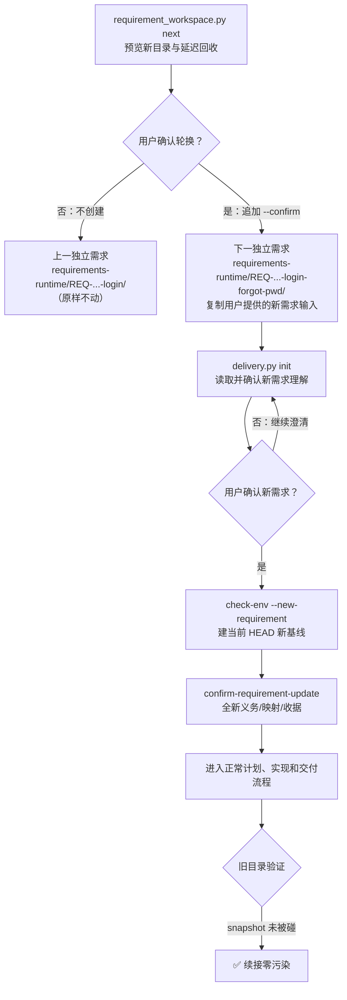

### 怎么执行

**你做什么**：明确说明上一需求已经完成或取消，并要求开始一个新的独立需求；同一需求的补充仍走增量闭环，不运行 next。

**AI 做什么**：
1. 执行 `requirement_workspace.py next` 只预览轮换动作，等待你追加 `--confirm`
2. 轮换确认后在 `<workspace_root>/requirements-runtime/REQ-日期-序号-名称/` 创建新目录，复制用户提供的新需求文件并更新 profile；不改写需求正文
3. 先跑 `delivery.py init`，展示并等待你确认新需求理解
4. 新需求确认后再跑 `check-env --new-requirement`（建当前 HEAD 新基线，不复用旧基线）
5. 后续和正常需求一样走计划确认、实现、测试和交付

**你看什么**：旧目录原样不动（零污染），新目录全新独立。

```bash
python3 scripts/requirement_workspace.py next \
  --config profiles/<需求>.yaml --title "<新需求中文名>" \
  --requirement-file <新需求文件> --previous-outcome 已完成
# 用户确认预览后，在同一命令追加 --confirm
python3 scripts/requirement_workspace.py next \
  --config profiles/<需求>.yaml --title "<新需求中文名>" \
  --requirement-file <新需求文件> --previous-outcome 已完成 --confirm
python3 scripts/delivery.py init --config profiles/<新需求>.yaml
python3 scripts/delivery.py check-env --new-requirement --config profiles/<新需求>.yaml
```

---

<a id="fd-docx"></a>
## 十、docx → md 事实源切换

### docx → md 摘要

1. **初始输入**：用户提供 docx，执行 `init` 按正文顺序读取内容。
2. **生成事实源**：文本型 docx 自动转写为 `docs/<需求名>.md`，保留标题、列表、表格和超链接，内嵌图片留下原文核对标记；图片型 docx 使用模板骨架创建空 md。
3. **后续统一读取**：`check-env`、确认、计划、route 和 gate 都以当前 md 为事实源，并绑定其摘要。
4. **保留原始文件**：docx 原样保留作初始记录，不作为后续事实源或回退来源。

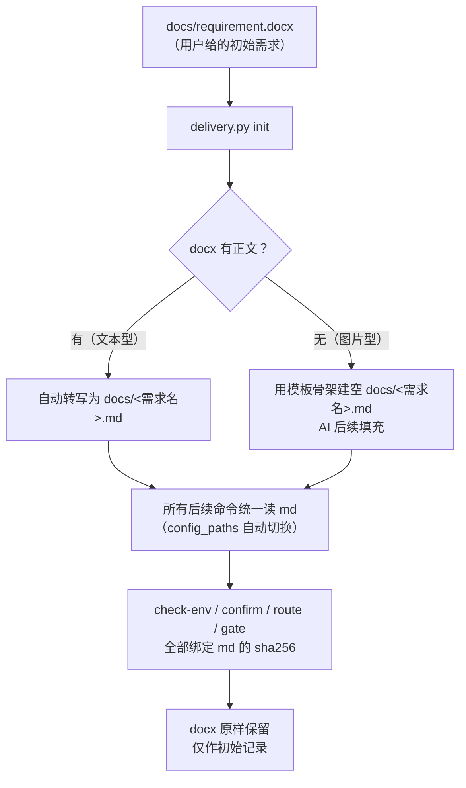

### 怎么执行

**你做什么**：把 docx 放进当前 profile 的 `requirement_dir` 并配置 `requirement_file`；项目内通道通常放在 `document/<日期-英文名>/docs/`，本机串行通道可由 `requirement_workspace.py next` 复制。

**AI 做什么**：跑 `init` 时自动按正文顺序读取 docx，保留标题、列表、表格和超链接并为内嵌图片留下原文核对标记，再转写成 `docs/<需求名>.md`。以后所有命令（check-env/confirm/route/gate）统一读该 md。图片型 docx 用模板骨架创建 `docs/<需求名>.md`，AI 在后续沟通中填充；旧根目录 md 不作为回退事实源。

**你看什么**：终端输出"已自动读取 docx 并转写为 docs/xxx.md（事实源）"，后续增量都在该 md 上改。
