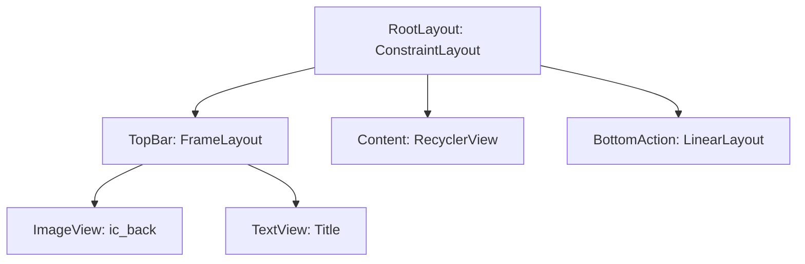

# 🎨 Figma 到 Android XML 规格报告

> [!NOTE]
> **目标屏幕**: {此处填写 Figma 画板名称}
> **画板尺寸 (px)**: {宽度 x 高度}
> **是否包含状态栏**: {是/否}
> **是否包含导航栏**: {是/否}
> **滚动行为**: {无/ScrollView/RecyclerView}

## 1. 尺寸换算引擎
> [!IMPORTANT]
> **（本小节必须明文写出以下换算，不可跳过）**
> - ANDROID_BASE_WIDTH（读自 .env）: `___dp`
> - Figma 画板宽度: `___px`
> - **Scale 换算率**: `___ ÷ ___ = ___`
> - **换算公式**: `Android (dp/sp) = Figma (px) × scale`

## 2. 设计令牌 (Tokens) 盘点

### 🎨 颜色 (Colors)
| Figma 值/名称 | Android 资源名 (@color/...) | 值 (HEX) | 用途说明 |
|---|---|---|---|

### 📏 尺寸 (Dimensions)
> [!WARNING]
> 阶段 3 写布局时必须 100% 硬编码内联。此处仅盘点数值。
| Figma 值/名称 | 换算后值 (dp/sp) | 用途说明 |
|---|---|---|

### 📝 排版 (Typography)
> [!WARNING]
> 阶段 3 写布局时必须 100% 硬编码内联。此处仅盘点数值。
| Figma 样式 | 字体/字号/行高 | 颜色 |
|---|---|---|

## 3. 布局结构树 (View Hierarchy)
> [!TIP]
> 请使用 mermaid 语法绘制 Android View 的层级嵌套关系。

## 4. 组件与状态映射 (Components & IDs)
| Figma 控件 | Android View 类 | **分配的 android:id** | 交互状态预留 |
|---|---|---|---|

## 5. 切图与资产清单
- [ ] 导出 VectorDrawable: 
- [ ] 下载 PNG/WebP 图片: 
- [ ] 图片占位及缩放模式 (ScaleType): 

## 6. 风险与降级方案
> [!CAUTION]
> - **缺失数据**: (例如缺失的字体、不清晰的阴影参数)
> - **降级方案**: (针对缺失数据的具体技术替代方案)
